# SageMaker Fine-Tuning: 14B SLMs for 3GPP Root Cause Analysis

Step-by-step guide for a fine-tuning benchmark that compares fine-tuned 14B SLMs against frontier foundation models on automated root cause analysis of 3GPP protocol logs in 5G SA core networks.

All steps use AWS managed services, with Amazon SageMaker Training Jobs as the primary compute option.

---

<a id="table-of-contents"></a>

## Table of Contents

1. [Provision Infrastructure](#1-provision-infrastructure)
   - [1.1 SageMaker Training Jobs (Recommended)](#11-sagemaker-training-jobs-recommended)
   - [1.2 EC2 Alternative](#12-ec2-alternative)
2. [Prepare Synthetic Training Data](#2-prepare-synthetic-training-data)
   - [2.1 S3 Bucket Structure](#21-s3-bucket-structure)
3. [Fine-Tune the SLMs](#3-fine-tune-the-slms)
   - [3.1 Install Dependencies](#31-install-dependencies)
   - [3.2 Submit Training Jobs](#32-submit-training-jobs)
   - [3.3 Monitor Training Progress](#33-monitor-training-progress)
   - [3.4 Training Results - Mistral-Nemo](#34-training-results---mistral-nemo)
   - [3.5 Training Results - Qwen3-14B](#35-training-results---qwen3-14b)
   - [3.6 Training Results - Gemma 3 12B](#36-training-results---gemma-3-12b)
   - [3.7 Training Summary - All Models](#37-training-summary---all-models)
   - [3.8 Save Adapters and Training Costs](#38-save-adapters-and-training-costs)
4. [Evaluate Frontier Models via Bedrock](#4-evaluate-frontier-models-via-bedrock)
   - [4.1 Prerequisites](#41-prerequisites)
   - [4.2 Prompt Strategies](#42-prompt-strategies)
   - [4.3 Run All 6 Evaluations](#43-run-all-6-evaluations)
   - [4.4 Score All 6 Runs](#44-score-all-6-runs)
   - [4.5 Results - Frontier Model Evaluation](#45-results---frontier-model-evaluation)
   - [4.6 Per-Class Breakdown](#46-per-class-breakdown-best-variant-per-model)
   - [4.7 Observations](#47-observations)
5. [Apply a Deterministic Post-Processing Filter](#5-apply-a-deterministic-post-processing-filter)
   - [5.1 How the Sympathetic Noise Codes Were Identified](#51-how-the-sympathetic-noise-codes-were-identified)
6. [Score with Consistent Metrics](#6-score-with-consistent-metrics)
   - [6.1 What Is the Ground-Truth Test Set?](#61-what-is-the-ground-truth-test-set)
   - [6.2 How Scoring Works](#62-how-scoring-works)
   - [6.3 Metrics Definitions](#63-metrics-definitions)
   - [6.4 Results Storage](#64-results-storage)
   - [6.5 SLM Inference and Evaluation](#65-slm-inference-and-evaluation)
     - [6.5.1 Inference Script](#651-inference-script)
     - [6.5.2 Submit Inference Jobs](#652-submit-inference-jobs)
     - [6.5.3 Score SLM Predictions](#653-score-slm-predictions)
     - [6.5.4 Results - SLM Evaluation](#654-results---slm-evaluation)
     - [6.5.5 Per-Class Breakdown - Mistral-Nemo (Best SLM)](#655-per-class-breakdown---mistral-nemo-best-slm)
     - [6.5.6 Per-Class Breakdown - Qwen3-14B (Best Config)](#656-per-class-breakdown---qwen3-14b-best-config)
     - [6.5.7 Qwen3 Optimization Journey](#657-qwen3-optimization-journey)
     - [6.5.8 Gemma 3 12B - Unresolved](#658-gemma-3-12b---unresolved)
7. [Final Results - All Models Compared](#7-final-results---all-models-compared)
8. [Validate with Real Operator Data](#8-validate-with-real-operator-data)
9. [Deploy and Run the Ensemble](#9-deploy-and-run-the-ensemble)
   - [9.1 SageMaker Real-Time Endpoint](#91-sagemaker-real-time-endpoint)
   - [9.2 EC2 Self-Hosted](#92-ec2-self-hosted)
   - [9.3 AWS Outposts and Edge](#93-aws-outposts-and-edge)
10. [Generate Reports](#10-generate-reports)
    - [10.1 HTML Report](#101-html-report)
    - [10.2 JavaScript PPT Presentation](#102-javascript-ppt-presentation)
11. [Glossary - Concepts and Acronyms](#glossary---concepts-and-acronyms)
    - [Models and Architecture](#models-and-architecture)
    - [Fine-Tuning](#fine-tuning)
    - [Prompting Strategies](#prompting-strategies)
    - [Evaluation Metrics](#evaluation-metrics)
    - [Telco and 3GPP Concepts](#telco-and-3gpp-concepts)
    - [Infrastructure and Cost](#infrastructure-and-cost)
    - [AWS Services](#aws-services)
    - [ML Libraries and Tools](#ml-libraries-and-tools)

> For the full execution log including all failed experiments, intermediate results, and debugging details, see [EXECUTION-LOG.md](EXECUTION-LOG.md).

---

## How to Run This Benchmark

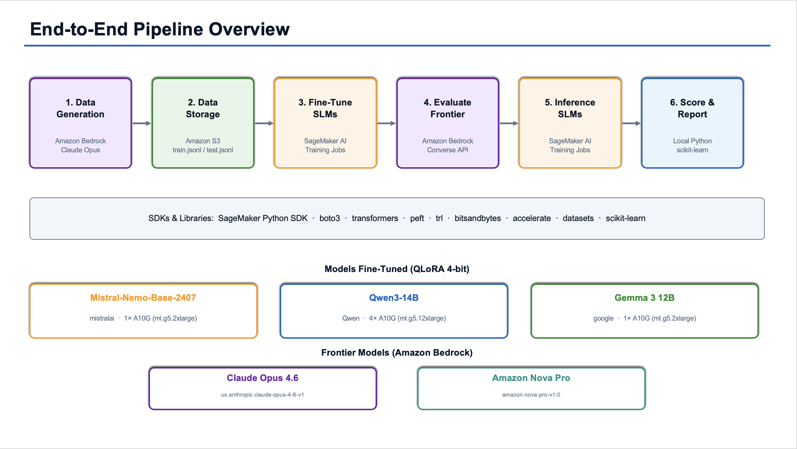

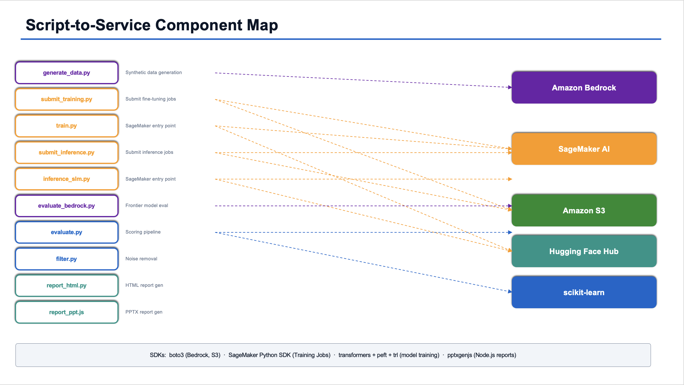

### 1. Provision Infrastructure
[↑ Back to Table of Contents](#table-of-contents)

**AWS Services: Amazon SageMaker Training Jobs (recommended) or Amazon EC2**

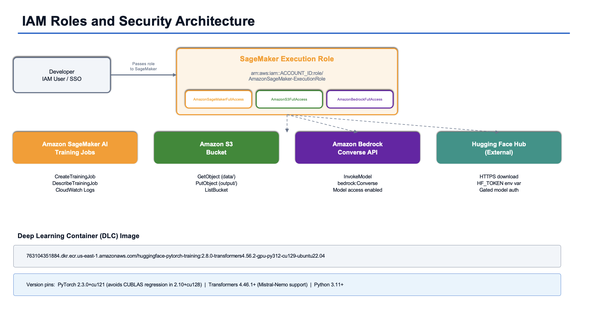

#### 1.1 SageMaker Training Jobs (Recommended)

SageMaker Training Jobs is the managed option — no instance provisioning, no SSH, no manual teardown. You provide a training script and an S3 dataset path, specify the instance type, and SageMaker handles the rest: spins up the GPU instance, runs the job, saves artifacts to S3, and terminates the instance automatically.

Steps:
1. Create an IAM role for SageMaker with `AmazonSageMakerFullAccess`, `AmazonS3FullAccess`, and `AmazonBedrockFullAccess` policies.
2. Upload your training script and dataset to S3 (covered in Step 2).
3. Submit a Training Job using the SageMaker Python SDK:

```python
from sagemaker.huggingface import HuggingFace

estimator = HuggingFace(
    entry_point="train.py",                        # your fine-tuning script
    source_dir="./src",
    instance_type="ml.g5.2xlarge",                 # 1× A10G GPU, equivalent to g6e.2xlarge
    instance_count=1,
    role="arn:aws:iam::ACCOUNT_ID:role/SageMakerRole",
    transformers_version="4.46.1",
    pytorch_version="2.3.0",
    py_version="py311",
    hyperparameters={
        "model_id": "mistralai/Mistral-Nemo-Base-2407",
        "max_steps": 325,
        "use_4bit": True,
    }
)

estimator.fit({"train": "s3://your-telco-llm-bucket/data/train.jsonl"})
# Adapter saved automatically to S3 when job completes
```

4. For Qwen3-14B QLoRA (4-bit, multi-GPU), use `ml.g5.12xlarge` (4× A10G GPUs) instead.
5. Monitor job progress in the [SageMaker Console](https://console.aws.amazon.com/sagemaker) → **Training** → **Training jobs**.

> **Why do all three models use QLoRA 4-bit?**
>
> All three 12B–14B models exceed the 24GB A10G VRAM limit when loaded in BF16 with training overhead. QLoRA compresses weights to 4-bit (~6–7GB), leaving headroom for activations, gradients, and optimizer states. Qwen3-14B additionally needs 4× GPUs (`ml.g5.12xlarge`) because its larger architecture generates heavier activations and optimizer states during training.

> Important: pin `pytorch_version="2.3.0"` (with `cu121`) in the estimator. `torch 2.10+cu128` has a CUBLAS regression that breaks all bf16/fp16 training. Use `transformers_version="4.46.1"` with `pytorch_version="2.3.0"` and `py_version="py311"`.

---

#### 1.2 EC2 Alternative

If you prefer direct GPU access for interactive development or debugging, launch a GPU-backed EC2 instance manually.

Steps:
1. Open the [EC2 Console](https://console.aws.amazon.com/ec2) and click **Launch Instance**.
2. Search for the AMI: **Deep Learning OSS Nvidia Driver AMI GPU PyTorch** (Ubuntu). Pre-installed with CUDA, PyTorch, and common ML libraries.
3. Select instance type `g6e.2xlarge` (1× L40S, $1.86/hr). For Qwen3-14B QLoRA, use `g6e.12xlarge` (4× L4 GPUs).
4. Attach an EBS volume of at least **200GB** (gp3) for model weights, datasets, and checkpoints.
5. Assign an IAM role with `AmazonS3FullAccess` and `AmazonBedrockFullAccess`.
6. Connect via AWS Systems Manager Session Manager (no port 22 needed).

```bash
# Verify GPU after connecting
nvidia-smi
python3 -c "import torch; print(torch.cuda.is_available())"

# Pin PyTorch version
pip install torch==2.9.0 --index-url https://download.pytorch.org/whl/cu121
```

---

### 2. Prepare Synthetic Training Data
[↑ Back to Table of Contents](#table-of-contents)

**AWS Services: Amazon Bedrock, Amazon S3**

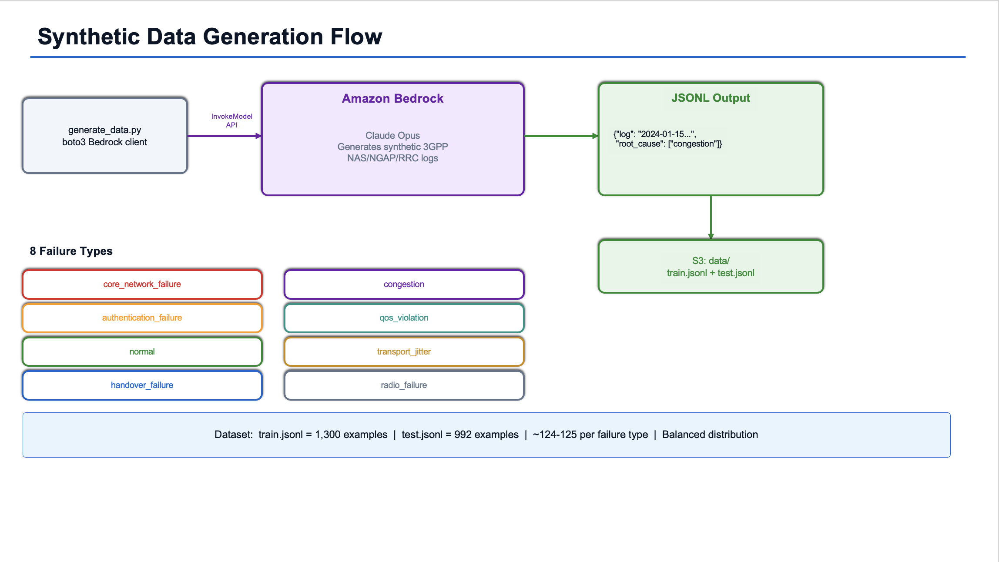

Use a frontier model via Amazon Bedrock to generate the synthetic 3GPP log dataset. This avoids needing real operator data for the initial experiment.

Steps:
1. Enable model access in the [Bedrock Console](https://console.aws.amazon.com/bedrock) → **Model access** → enable Claude 4.6 Opus or Nova Pro.
2. Write a data generation script that calls the Bedrock API to produce labeled examples. Each example = a synthetic 3GPP signaling log + a ground-truth JSON with root cause error codes.

```python
import boto3, json

bedrock = boto3.client("bedrock-runtime", region_name="us-east-1")

prompt = """Generate a synthetic 3GPP NAS/NGAP/RRC signaling log for a 5G SA core
showing a UPF degradation cascade failure. Include sympathetic noise events
(heartbeat timeouts, keepalives). Output JSON: {"log": "...", "root_cause": [...]}"""

response = bedrock.invoke_model(
    modelId="anthropic.claude-opus-4-5",
    body=json.dumps({"messages": [{"role": "user", "content": prompt}],
                     "max_tokens": 2048, "anthropic_version": "bedrock-2023-05-31"})
)
```

3. Generate 1,300 training examples and 1,000 test examples across all 8 failure types:
   - `core_network_failure`, `authentication_failure`, `normal`, `handover_failure`
   - `congestion`, `qos_violation`, `transport_jitter`, `radio_failure`

4. Upload the datasets to **Amazon S3**:

```bash
aws s3 mb s3://your-telco-llm-bucket
aws s3 cp train.jsonl s3://your-telco-llm-bucket/data/train.jsonl
aws s3 cp test.jsonl  s3://your-telco-llm-bucket/data/test.jsonl
```

#### 2.1 S3 Bucket Structure

As you progress through the benchmark steps, the S3 bucket accumulates artifacts from data upload, training, inference, and evaluation:

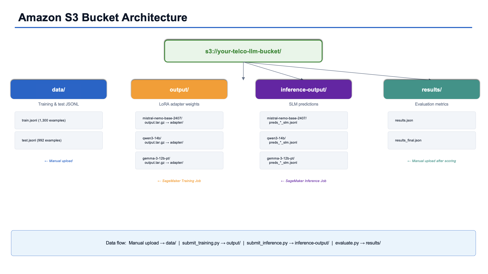

```
s3://your-telco-llm-bucket/
│
├── data/                                          # Uploaded by you (Step 2)
│   ├── train.jsonl                                #   1,300 training examples
│   └── test.jsonl                                 #   992 test examples
│
├── output/                                        # Created by SageMaker Training Jobs (Steps 3 & 6)
│   ├── mistral-nemo-base-2407/                    #   One subfolder per model slug
│   │   └── telco-rca-mistral-nemo-...-833/
│   │       └── output/output.tar.gz              #     Tarball containing adapter/ + checkpoint-N/
│   ├── qwen3-14b/
│   │   └── telco-rca-qwen3-14b-...-355/
│   │       └── output/output.tar.gz
│   └── gemma-3-12b-pt/
│       └── telco-rca-gemma-3-12b-pt-...-774/
│           └── output/output.tar.gz
│
├── inference-output/                              # Created by submit_inference.py (Step 6.5)
│   ├── mistral-nemo-base-2407/
│   │   └── telco-rca-infer-...-993/
│   │       └── output/output.tar.gz              #     Contains preds_<slug>_slm.jsonl
│   ├── qwen3-14b/
│   └── gemma-3-12b-pt/
│
├── results/                                       # Uploaded by you after scoring (Step 6)
│   └── results.json                               #   Accumulated metrics for all models/strategies
│
└── code/                                          # Auto-uploaded by submit_inference.py
    └── src/                                       #   Copy of src/ for SageMaker job access
```

| Path | Created By | Description |
|------|-----------|-------------|
| `data/` | Manual upload (Step 2) | Training and test JSONL datasets |
| `output/<model-slug>/` | `submit_training.py` → SageMaker Training Job | LoRA adapter weights packaged as `output.tar.gz` |
| `inference-output/<model-slug>/` | `submit_inference.py` → SageMaker Training Job | Inference predictions packaged as `output.tar.gz` |
| `results/` | Manual upload after running `src/evaluate.py` | Accumulated `results.json` with metrics for all models and strategies |

---

### 3. Fine-Tune the SLMs
[↑ Back to Table of Contents](#table-of-contents)

**AWS Service: Amazon SageMaker Training Jobs or Amazon EC2**

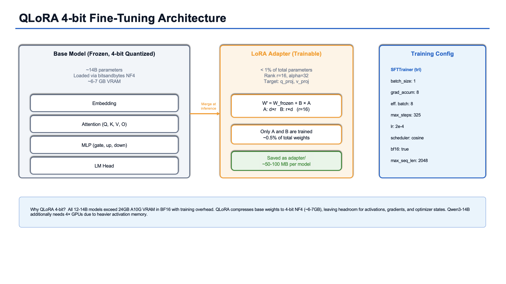

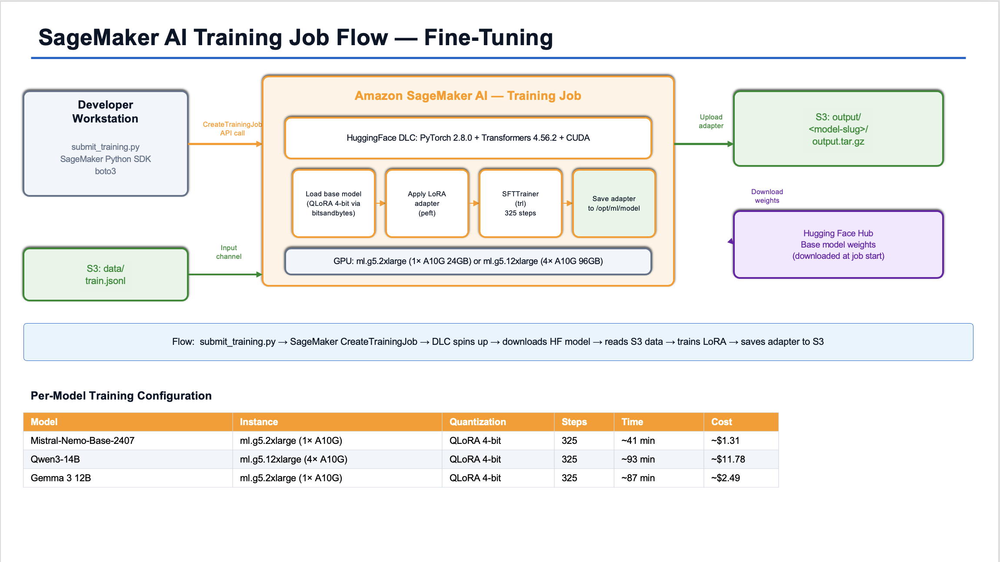

Run LoRA/QLoRA fine-tuning using the [Hugging Face TRL](https://github.com/huggingface/trl) library and PEFT.

#### 3.1 Install Dependencies

```bash
pip install sagemaker
pip install transformers peft trl datasets accelerate bitsandbytes huggingface_hub scikit-learn
```

Install the Hugging Face CLI (`hf`) using the standalone installer:

```bash
sudo apt install -y python3.11-venv
curl -LsSf https://hf.co/cli/install.sh | bash
export PATH="/home/ubuntu/.local/bin:$PATH"
echo 'export PATH="/home/ubuntu/.local/bin:$PATH"' >> ~/.bashrc
hf auth login
```

#### 3.2 Submit Training Jobs

Submit SageMaker Training Jobs using `submit_training.py`:

```bash
# Mistral-Nemo — QLoRA 4-bit on 1× A10G (ml.g5.2xlarge)
python3 submit_training.py \
  --role arn:aws:iam::ACCOUNT_ID:role/SageMakerRole \
  --bucket your-telco-llm-bucket \
  --model_id mistralai/Mistral-Nemo-Base-2407 \
  --max_steps 325

# Qwen3-14B — QLoRA 4-bit on 4× A10G (ml.g5.12xlarge)
python3 submit_training.py \
  --role arn:aws:iam::ACCOUNT_ID:role/SageMakerRole \
  --bucket your-telco-llm-bucket \
  --model_id Qwen/Qwen3-14B \
  --max_steps 325

# Gemma 3 12B — QLoRA 4-bit on 1× A10G (ml.g5.2xlarge)
python3 submit_training.py \
  --role arn:aws:iam::ACCOUNT_ID:role/SageMakerRole \
  --bucket your-telco-llm-bucket \
  --model_id google/gemma-3-12b-pt \
  --max_steps 325 \
  --hf_token YOUR_HF_TOKEN
```

The script auto-selects the correct instance type and quantization mode per model. Add `--wait` to block and stream status until the job completes.

> **Why `--max_steps 325`?** The training set has 1,300 examples. With `per_device_train_batch_size=1` and `gradient_accumulation_steps=8`, the effective batch size is 8. 1,300 ÷ 8 = 162.5 steps per epoch → 325 steps ≈ 2 epochs. Two epochs is a common sweet spot for LoRA/QLoRA fine-tuning on small datasets.

> **Model-specific notes:**
> - Qwen3-14B uses a chat template format (`<|im_start|>` / `<|im_end|>` tokens) for training and inference, configured automatically via `CHAT_TEMPLATE_MODELS` in `train.py`. This is critical for Qwen3's performance — see [Section 6.5.7](#657-qwen3-optimization-journey).
> - Gemma requires a Hugging Face token (`--hf_token`) because `google/gemma-3-12b-pt` is a gated model.

#### 3.3 Monitor Training Progress

```bash
# One-shot status check
aws sagemaker describe-training-job \
  --training-job-name <job-name> \
  --query 'TrainingJobStatus' --output text

# Stream CloudWatch logs
aws logs tail /aws/sagemaker/TrainingJobs \
  --log-stream-name-prefix <job-name> --follow
```

#### 3.4 Training Results - Mistral-Nemo

```
Step  25  | loss: 3.4207 | epoch: 0.15
Step  50  | loss: 1.6251 | epoch: 0.31
Step 100  | loss: 1.3540 | epoch: 0.62
Step 200  | loss: 1.0485 | epoch: 1.23
Step 300  | loss: 0.9620 | epoch: 1.85
Step 325  | loss: 1.0355 | epoch: 2.01
```

> **Training Summary — Mistral-Nemo QLoRA 4-bit**
> - **Steps**: 325/325, ~41 min, 2 epochs on `ml.g5.2xlarge` (1× A10G)
> - **Final loss**: 1.035 (started ~3.4, dropped steadily — healthy convergence)
> - **Average train loss**: 1.359

#### 3.5 Training Results - Qwen3-14B

```
Step  25  | loss: 0.5811 | epoch: 0.15
Step 100  | loss: 0.5881 | epoch: 0.62
Step 200  | loss: 0.5784 | epoch: 1.23
Step 325  | loss: 0.6052 | epoch: 2.01
```

> **Training Summary — Qwen3-14B QLoRA 4-bit**
> - **Steps**: 325/325, ~93 min, 2 epochs on `ml.g5.12xlarge` (4× A10G)
> - **Final loss**: 0.605 (started low ~0.58, stayed flat — model already has strong priors)
> - **Mean token accuracy**: 86.8%
>
> The flat loss curve indicates Qwen3's pre-trained weights already produce reasonable predictions for structured JSON output tasks. The LoRA adapter makes fine adjustments rather than learning from scratch.

#### 3.6 Training Results - Gemma 3 12B

```
Step  25  | loss: 4.8850 | epoch: 0.15
Step 100  | loss: 4.9919 | epoch: 0.62
Step 200  | loss: 4.8559 | epoch: 1.23
Step 325  | loss: 5.1441 | epoch: 2.01
```

> **Training Summary — Gemma 3 12B QLoRA 4-bit**
> - **Steps**: 325/325, ~87 min, 2 epochs on `ml.g5.2xlarge` (1× A10G)
> - **Final loss**: 5.144 (high absolute loss due to different tokenizer/vocabulary — not directly comparable to other models)
> - **Mean token accuracy**: 86.5%

#### 3.7 Training Summary - All Models


| Model | Method | Instance | Steps | Time | Final Loss | Avg Loss | Token Acc |
|-------|--------|----------|-------|------|-----------|----------|-----------|
| Mistral-Nemo-Base-2407 | QLoRA 4-bit | ml.g5.2xlarge (1× A10G) | 325/325 | ~41 min | 1.035 | 1.359 | — |
| Qwen3-14B | QLoRA 4-bit | ml.g5.12xlarge (4× A10G) | 325/325 | ~93 min | 0.605 | 0.582 | 86.8% |
| Gemma 3 12B | QLoRA 4-bit | ml.g5.2xlarge (1× A10G) | 325/325 | ~87 min | 5.144 | 4.920 | 86.5% |

> Loss scales differ across models due to architecture and tokenizer differences — the evaluation metrics (F1, precision, recall) in Step 6 provide the true apples-to-apples comparison.

#### 3.8 Save Adapters and Training Costs

```bash
# Adapters are saved automatically by train.py and uploaded to S3 on job completion
# Download all three adapters locally:
aws s3 cp s3://your-telco-llm-bucket/output/mistral-nemo-base-2407/adapter/ ./adapters/mistral-nemo/ --recursive
aws s3 cp s3://your-telco-llm-bucket/output/qwen3-14b/adapter/ ./adapters/qwen3/ --recursive
aws s3 cp s3://your-telco-llm-bucket/output/gemma-3-12b-pt/adapter/ ./adapters/gemma3/ --recursive
```

Training cost reference (SageMaker on-demand pricing, us-east-1):

| Model | Method | GPU | Billable Time | Training Cost |
|-------|--------|-----|---------------|---------------|
| Mistral-Nemo-Base-2407 | QLoRA 4-bit | 1× A10G (ml.g5.2xlarge) | ~52 min | ~$1.31 |
| Qwen3-14B | QLoRA 4-bit | 4× A10G (ml.g5.12xlarge) | ~100 min | ~$11.78 |
| Gemma 3 12B | QLoRA 4-bit | 1× A10G (ml.g5.2xlarge) | ~99 min | ~$2.49 |

---

### 4. Evaluate Frontier Models via Bedrock
[↑ Back to Table of Contents](#table-of-contents)

**AWS Service: Amazon Bedrock**

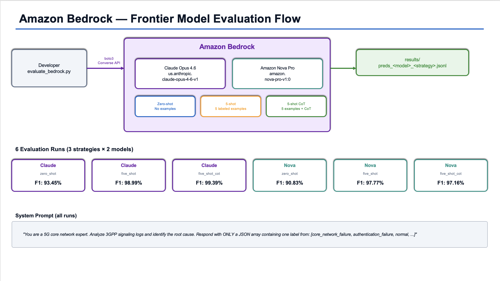

Run Claude Opus 4.6 and Amazon Nova Pro against the 992-scenario test set using three prompt strategies per model (6 runs total).

#### 4.1 Prerequisites

Ensure the IAM role has `AmazonBedrockFullAccess` and that both models are enabled in the Bedrock console (us-east-1).

Model IDs used:
- Claude Opus 4.6: `us.anthropic.claude-opus-4-6-v1` (inference profile)
- Amazon Nova Pro: `amazon.nova-pro-v1:0`

The evaluation script (`src/evaluate_bedrock.py`) uses the Bedrock **Converse API** (`bedrock.converse()`), which provides a uniform request/response format across both providers.

#### 4.2 Prompt Strategies

| Strategy | Description | Few-shot examples | CoT suffix |
|----------|-------------|-------------------|------------|
| `zero_shot` | No examples, direct classification | 0 | No |
| `five_shot` | 5 labeled examples prepended as user/assistant turns | 5 (first 5 from test set) | No |
| `five_shot_cot` | Same as 5-shot, plus chain-of-thought instruction | 5 (first 5 from test set) | "Think step by step, then output the JSON array." |

System prompt used for all runs:
```
You are a 5G core network expert. Analyze 3GPP signaling logs and identify the root cause.
Respond with ONLY a JSON array containing one label from:
[core_network_failure, authentication_failure, normal, handover_failure,
congestion, qos_violation, transport_jitter, radio_failure]
```

#### 4.3 Run All 6 Evaluations

```bash
# Nova Pro — 3 strategies
python3 src/evaluate_bedrock.py --model nova --strategy zero_shot
python3 src/evaluate_bedrock.py --model nova --strategy five_shot
python3 src/evaluate_bedrock.py --model nova --strategy five_shot_cot

# Claude Opus 4.6 — 3 strategies
python3 src/evaluate_bedrock.py --model claude --strategy zero_shot
python3 src/evaluate_bedrock.py --model claude --strategy five_shot
python3 src/evaluate_bedrock.py --model claude --strategy five_shot_cot
```

#### 4.4 Score All 6 Runs

```bash
# Score Nova
python3 src/evaluate.py --predictions results/preds_nova_zero_shot.jsonl --model nova --strategy zero_shot
python3 src/evaluate.py --predictions results/preds_nova_five_shot.jsonl --model nova --strategy five_shot
python3 src/evaluate.py --predictions results/preds_nova_five_shot_cot.jsonl --model nova --strategy five_shot_cot

# Score Claude
python3 src/evaluate.py --predictions results/preds_claude_zero_shot.jsonl --model claude --strategy zero_shot
python3 src/evaluate.py --predictions results/preds_claude_five_shot.jsonl --model claude --strategy five_shot
python3 src/evaluate.py --predictions results/preds_claude_five_shot_cot.jsonl --model claude --strategy five_shot_cot

# Upload results
aws s3 cp results/results.json s3://your-telco-llm-bucket/results/results.json
```

#### 4.5 Results - Frontier Model Evaluation

| Model | Strategy | F1 | Precision | Recall | Exact Match | n |
|-------|----------|---:|----------:|-------:|------------:|--:|
| Claude Opus 4.6 | zero_shot | 93.45% | 93.45% | 93.45% | 93.45% | 992 |
| Claude Opus 4.6 | five_shot | 98.99% | 98.99% | 98.99% | 98.99% | 987 |
| Claude Opus 4.6 | five_shot_cot | 99.39% | 99.39% | 99.39% | 99.39% | 987 |
| Nova Pro | zero_shot | 90.83% | 90.83% | 90.83% | 90.83% | 992 |
| Nova Pro | five_shot | 97.77% | 97.77% | 97.77% | 97.77% | 987 |
| Nova Pro | five_shot_cot | 97.16% | 97.16% | 97.16% | 97.16% | 987 |

Best variant per model: Claude Opus 4.6 five_shot_cot (99.4% F1), Nova Pro five_shot (97.8% F1).

#### 4.6 Per-Class Breakdown (Best Variant per Model)

**Claude Opus 4.6 — five_shot_cot (F1=99.39%)**

| Failure Type | F1 | Precision | Recall | n |
|-------------|---:|----------:|-------:|--:|
| authentication_failure | 100.00% | 100.00% | 100.00% | 124 |
| congestion | 100.00% | 100.00% | 100.00% | 124 |
| core_network_failure | 100.00% | 100.00% | 100.00% | 124 |
| handover_failure | 99.60% | 99.21% | 100.00% | 125 |
| normal | 99.57% | 99.15% | 100.00% | 117 |
| qos_violation | 100.00% | 100.00% | 100.00% | 125 |
| radio_failure | 97.60% | 96.83% | 98.39% | 124 |
| transport_jitter | 98.36% | 100.00% | 96.77% | 124 |

**Nova Pro — five_shot (F1=97.77%)**

| Failure Type | F1 | Precision | Recall | n |
|-------------|---:|----------:|-------:|--:|
| authentication_failure | 100.00% | 100.00% | 100.00% | 124 |
| congestion | 100.00% | 100.00% | 100.00% | 124 |
| core_network_failure | 100.00% | 100.00% | 100.00% | 124 |
| handover_failure | 93.63% | 88.03% | 100.00% | 125 |
| normal | 99.15% | 98.32% | 100.00% | 117 |
| qos_violation | 100.00% | 100.00% | 100.00% | 125 |
| radio_failure | 90.99% | 97.25% | 85.48% | 124 |
| transport_jitter | 98.36% | 100.00% | 96.77% | 124 |

#### 4.7 Observations

- Few-shot examples matter a lot — both models jump ~7pp from zero-shot to 5-shot.
- CoT helps Claude (+0.4pp) but slightly hurts Nova (−0.6pp).
- Both models struggle most with `radio_failure` and `transport_jitter` — these failure types have overlapping signal patterns in the logs.
- Perfect scores on 5 of 8 failure types (`authentication_failure`, `congestion`, `core_network_failure`, `qos_violation`, and `normal`).

---

### 5. Apply a Deterministic Post-Processing Filter
[↑ Back to Table of Contents](#table-of-contents)

**Implementation: `src/filter.py`** (applied automatically by `src/evaluate.py`)

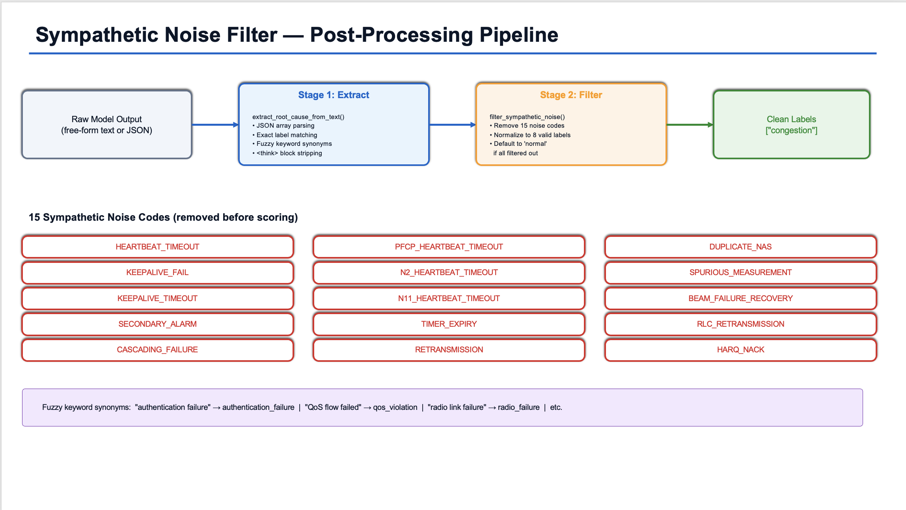

Before scoring any model output, the same noise-removal filter is applied to all responses — both fine-tuned SLMs and Bedrock frontier models. This strips sympathetic noise events from the predicted root cause list and normalizes labels to the 8 valid failure types.

> **No manual step required.** The filter is integrated into the scoring pipeline. When you run `python3 src/evaluate.py`, it imports `filter_sympathetic_noise` and `extract_root_cause_from_text` from `src/filter.py` and applies them to every prediction before computing metrics.

The filter does three things:

1. **Removes sympathetic noise codes** — strips 15 known noise labels (e.g., `HEARTBEAT_TIMEOUT`, `KEEPALIVE_FAIL`, `CASCADING_FAILURE`, `HARQ_NACK`) that appear in model outputs but are not root causes.
2. **Normalizes to valid labels** — only keeps predictions that match one of the 8 valid root cause types.
3. **Defaults to `"normal"`** — if all predicted labels are filtered out, the prediction defaults to `"normal"`.

Additionally, `extract_root_cause_from_text()` parses free-form model output into structured labels using:
- JSON array extraction (`["label"]` patterns)
- Exact canonical label matching
- Fuzzy keyword synonym matching (e.g., "authentication failure" → `authentication_failure`, "QoS flow failed" → `qos_violation`)
- `<think>...</think>` block stripping (for Qwen3's reasoning mode)

```python
# src/filter.py — sympathetic noise codes
SYMPATHETIC_CODES = {
    "HEARTBEAT_TIMEOUT", "KEEPALIVE_FAIL", "KEEPALIVE_TIMEOUT",
    "SECONDARY_ALARM", "CASCADING_FAILURE", "PFCP_HEARTBEAT_TIMEOUT",
    "N2_HEARTBEAT_TIMEOUT", "N11_HEARTBEAT_TIMEOUT", "TIMER_EXPIRY",
    "RETRANSMISSION", "DUPLICATE_NAS", "SPURIOUS_MEASUREMENT",
    "BEAM_FAILURE_RECOVERY", "RLC_RETRANSMISSION", "HARQ_NACK",
}
```

#### 5.1 How the Sympathetic Noise Codes Were Identified

These codes come from 3GPP protocol domain knowledge about which events are "sympathetic" (secondary/consequential) rather than root causes:

- **Heartbeat/keepalive timeouts** — fire when a network function stops responding, but they're a symptom, not the cause
- **Cascading/secondary events** — explicitly consequential downstream alarms
- **Retransmission/recovery noise** — automatic retry mechanisms that appear during any disruption
- **Timer/measurement noise** — generic expirations that don't point to a specific root cause

---

### 6. Score with Consistent Metrics
[↑ Back to Table of Contents](#table-of-contents)

**Implementation: `src/evaluate.py`**

#### 6.1 What Is the Ground-Truth Test Set?

`data/test.jsonl` — 992 synthetic 3GPP signaling log scenarios, each with a known root cause label. Roughly balanced across all 8 failure types (~124-125 each).

```json
{
  "log": "2024-01-15 10:23:41.123 [AMF] Sending Overload Start with reduction percentage: 50\n...",
  "root_cause": ["congestion"]
}
```

#### 6.2 How Scoring Works

```bash
python3 src/evaluate.py \
  --predictions results/preds_<model>_<strategy>.jsonl \
  --test data/test.jsonl \
  --model <model_name> \
  --strategy <strategy_name>
```

The script: loads test set and predictions → auto-aligns if counts differ → extracts root causes → applies sympathetic noise filter → computes metrics → appends to `results/results.json`.

#### 6.3 Metrics Definitions

| Metric | Definition |
|--------|-----------|
| F1 (micro) | Harmonic mean of precision and recall, computed globally |
| Precision (micro) | Fraction of predicted labels that match ground truth |
| Recall (micro) | Fraction of ground truth labels correctly predicted |
| Exact Match | Fraction of examples where predicted label exactly equals ground truth |

For single-label classification, micro F1 = Precision = Recall = Exact Match.

#### 6.4 Results Storage

All results accumulate in `results/results.json`:

```bash
aws s3 cp results/results.json s3://your-telco-llm-bucket/results/results.json
```

#### 6.5 SLM Inference and Evaluation

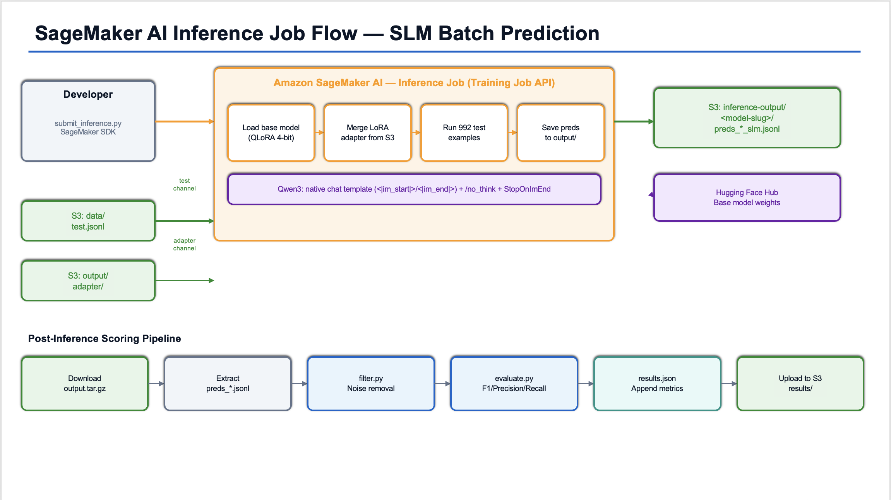

##### 6.5.1 Inference Script

The inference entry point (`src/inference_slm.py`) loads the base model in QLoRA 4-bit, merges the LoRA adapter from S3, and runs predictions on all 992 test examples.

For Mistral-Nemo and Gemma, the prompt template is:
```
### Instruction
Analyze the following 3GPP signaling log and identify the root cause.

### Log
{log}

### Root Cause
```

For Qwen3-14B, the inference script uses the native chat template with `/no_think` to disable thinking mode:
```
<|im_start|>system
You are a 3GPP root cause analysis assistant. Given a signaling log, respond with ONLY a JSON array of root cause labels. Valid labels: core_network_failure, authentication_failure, normal, handover_failure, congestion, qos_violation, transport_jitter, radio_failure. Example: ["congestion"] /no_think<|im_end|>
<|im_start|>user
{log}<|im_end|>
<|im_start|>assistant
```

A custom `StopOnImEnd` stopping criteria halts generation at `<|im_end|>` so the model outputs only the JSON array.

##### 6.5.2 Submit Inference Jobs

Use `submit_inference.py` to submit a SageMaker Training Job for each model:

> **Note:** `submit_inference.py` uses the Training Job API (not Processing Jobs) because the default account quota for `ml.g5.2xlarge` Processing Jobs is 0.

```bash
# Mistral-Nemo (1× A10G)
python3 submit_inference.py \
  --role arn:aws:iam::ACCOUNT_ID:role/service-role/AmazonSageMaker-ExecutionRole \
  --bucket your-telco-llm-bucket \
  --model_id mistralai/Mistral-Nemo-Base-2407

# Qwen3-14B (4× A10G)
python3 submit_inference.py \
  --role arn:aws:iam::ACCOUNT_ID:role/service-role/AmazonSageMaker-ExecutionRole \
  --bucket your-telco-llm-bucket \
  --model_id Qwen/Qwen3-14B

# Gemma 3 12B (1× A10G, requires HF token)
python3 submit_inference.py \
  --role arn:aws:iam::ACCOUNT_ID:role/service-role/AmazonSageMaker-ExecutionRole \
  --bucket your-telco-llm-bucket \
  --model_id google/gemma-3-12b-pt \
  --hf_token $HF_TOKEN
```

##### 6.5.3 Score SLM Predictions

After each inference job completes, download the output tarballs from S3, extract, and score:

```bash
# Download and extract
aws s3 cp s3://your-telco-llm-bucket/inference-output/<model-slug>/<job-name>/output/output.tar.gz /tmp/<model>/
tar -xzf /tmp/<model>/output.tar.gz -C /tmp/<model>/
cp /tmp/<model>/preds_*_slm.jsonl results/

# Score each model
python3 src/evaluate.py --predictions results/preds_mistral-nemo-base-2407_slm.jsonl --model mistral-nemo --strategy slm
python3 src/evaluate.py --predictions results/preds_qwen3-14b_optionH_slm.jsonl --model qwen3-optionH-nothink --strategy slm
python3 src/evaluate.py --predictions results/preds_gemma-3-12b-pt_slm.jsonl --model gemma --strategy slm

# Upload updated results
aws s3 cp results/results.json s3://your-telco-llm-bucket/results/results.json
```

##### 6.5.4 Results - SLM Evaluation

| Model | Configuration | F1 | Precision | Recall | Exact Match | n |
|-------|--------------|---:|----------:|-------:|------------:|--:|
| Mistral-Nemo-Base-2407 | QLoRA 4-bit | 99.70% | 99.70% | 99.70% | 99.70% | 992 |
| Qwen3-14B | QLoRA 4-bit + chat template + /no_think | 77.42% | 77.42% | 77.42% | 77.42% | 992 |
| Gemma 3 12B | QLoRA 4-bit | 11.90% | 11.90% | 11.90% | 11.90% | 992 |

**Analysis:**

- **Mistral-Nemo (99.7% F1)** — The clear winner. Outperforms every frontier model configuration including Claude five_shot_cot (99.4%). Only 3 out of 992 examples were misclassified. The model learned both the task and the output format perfectly.

- **Qwen3-14B (77.4% F1)** — Competitive after optimization. Achieves high precision (100% on 5 of 8 classes) but lower recall on `qos_violation` (14.4%) and `transport_jitter` (48.8%). Places between Nova zero-shot (90.8%) and Claude zero-shot (93.5%) in the ranking.

- **Gemma 3 12B (11.9% F1)** — Produces empty outputs for all 992 examples, defaulting to `["normal"]`. The 11.9% F1 corresponds exactly to the proportion of `normal` examples in the test set (118/992). The LoRA adapter was insufficient to teach this pure pre-trained model structured generation. See [Section 6.5.8](#658-gemma-3-12b---unresolved).

##### 6.5.5 Per-Class Breakdown - Mistral-Nemo (Best SLM)

| Failure Type | F1 | Precision | Recall | n |
|-------------|---:|----------:|-------:|--:|
| core_network_failure | 100.00% | 100.00% | 100.00% | 125 |
| authentication_failure | 99.60% | 100.00% | 99.19% | 124 |
| normal | 98.74% | 97.52% | 100.00% | 118 |
| handover_failure | 100.00% | 100.00% | 100.00% | 125 |
| congestion | 100.00% | 100.00% | 100.00% | 125 |
| qos_violation | 100.00% | 100.00% | 100.00% | 125 |
| transport_jitter | 99.19% | 100.00% | 98.40% | 125 |
| radio_failure | 100.00% | 100.00% | 100.00% | 125 |

Mistral-Nemo achieves 100% F1 on 6 of 8 failure types. The only imperfect classes are `authentication_failure` (1 miss) and `transport_jitter` (2 misses).

##### 6.5.6 Per-Class Breakdown - Qwen3-14B (Best Config)

| Failure Type | F1 | Precision | Recall | n |
|-------------|---:|----------:|-------:|--:|
| core_network_failure | 98.37% | 100.00% | 96.80% | 125 |
| authentication_failure | 92.64% | 100.00% | 86.29% | 124 |
| normal | 62.27% | 45.21% | 100.00% | 118 |
| handover_failure | 90.35% | 100.00% | 82.40% | 125 |
| congestion | 90.55% | 89.15% | 92.00% | 125 |
| qos_violation | 25.17% | 100.00% | 14.40% | 125 |
| transport_jitter | 65.59% | 100.00% | 48.80% | 125 |
| radio_failure | 78.86% | 65.10% | 100.00% | 125 |

Qwen3 achieves 100% precision on 5 of 8 classes (it rarely predicts a wrong label), but recall is low on `qos_violation` and `transport_jitter` — the model defaults to `normal` instead of recognizing these failure types.

##### 6.5.7 Qwen3 Optimization Journey

Qwen3-14B required several iterations to reach 77.4% F1. The key insight: the model was reasoning correctly all along, but the training format and extraction pipeline were the bottlenecks.

| Option | Change | Qwen3 F1 | Result |
|--------|--------|----------|--------|
| Original | Raw `### Instruction` format, 64 tokens | 17.24% | Baseline — verbose prose output, only `congestion` extracted |
| B | Retrain (same model, already unified base+instruct) | 17.14% | ❌ No improvement |
| C | Completion-only training (prompt/completion format) | 17.24% | ❌ No improvement |
| D+E | Improved keyword filter + 128 tokens | 76.31% | ✅ Massive jump — model was correct all along |
| H | Native chat template + `/no_think` | 77.42% | ✅ Best config — cleaner JSON output |

**What worked:**
- **Option D+E (improved filter + longer generation)** — The `extract_root_cause_from_text` filter was enhanced with keyword synonyms and fuzzy regex matching to catch natural-language labels like "authentication failure" → `authentication_failure`. Combined with increasing `max_new_tokens` from 64 to 128, this unlocked the model's actual reasoning ability.
- **Option H (chat template)** — Training and inferring with Qwen3's native `<|im_start|>` / `<|im_end|>` format, plus the `/no_think` suffix to disable thinking mode, produced cleaner JSON output and a marginal F1 improvement.

**Key lesson:** Qwen3's built-in "thinking mode" consumes the token budget with `<think>...</think>` reasoning blocks. The `/no_think` suffix in the system prompt is essential — without it, F1 drops to 35.5%.

> For full details on each failed and successful option, see [EXECUTION-LOG.md](EXECUTION-LOG.md) sections 6.5.6 through 6.5.14.

##### 6.5.8 Gemma 3 12B - Unresolved

Gemma 3 12B (`google/gemma-3-12b-pt`) produces empty outputs for all 992 test examples across all configurations tested (original, instruction-tuned `-it` variant, completion-only training, improved filter). The 11.9% F1 is entirely from the `normal` fallback default.

The root cause: `gemma-3-12b-pt` is a pure pre-trained model with zero instruction-following capability. The LoRA adapter (< 1% of parameters) was insufficient to teach it structured generation from scratch. Potential fixes not yet attempted:
- **Option F** — Higher LoRA rank (`r=64`) with MLP target modules
- **Option G** — More training data (5,000–10,000 examples) and epochs
- **Option H** — Chat template format (as done for Qwen3)

---

### 7. Final Results - All Models Compared
[↑ Back to Table of Contents](#table-of-contents)

| Rank | Model | Type | Strategy | F1 | n |
|------|-------|------|----------|---:|--:|
| 1 | **Mistral-Nemo-Base-2407** | **SLM (QLoRA 4-bit)** | **fine-tuned** | **99.70%** | **992** |
| 2 | Claude Opus 4.6 | Frontier (Bedrock) | five_shot_cot | 99.39% | 987 |
| 3 | Claude Opus 4.6 | Frontier (Bedrock) | five_shot | 98.99% | 987 |
| 4 | Nova Pro | Frontier (Bedrock) | five_shot | 97.77% | 987 |
| 5 | Nova Pro | Frontier (Bedrock) | five_shot_cot | 97.16% | 987 |
| 6 | Claude Opus 4.6 | Frontier (Bedrock) | zero_shot | 93.45% | 992 |
| 7 | Nova Pro | Frontier (Bedrock) | zero_shot | 90.83% | 992 |
| 8 | **Qwen3-14B** | **SLM (QLoRA 4-bit)** | **fine-tuned + chat template** | **77.42%** | **992** |
| 9 | Gemma 3 12B | SLM (QLoRA 4-bit) | fine-tuned | 11.90% | 992 |

**Key takeaways:**

- **Mistral-Nemo with QLoRA 4-bit fine-tuning outperforms all frontier models** — 99.7% F1 vs Claude's best 99.4% — at a fraction of the inference cost (self-hosted GPU vs per-token API pricing).
- **Qwen3-14B is competitive after optimization** — 77.4% F1 with chat template training and `/no_think`, placing it between the frontier models' zero-shot configurations.
- **Gemma 3 12B requires more fundamental changes** to produce any useful output on this task.
- **Domain-specific fine-tuning works** — a 12B parameter SLM fine-tuned on 1,300 synthetic examples for ~$1.31 in compute can match or exceed frontier models that cost orders of magnitude more per inference.

---

### 8. Validate with Real Operator Data
[↑ Back to Table of Contents](#table-of-contents)

**AWS Services: Amazon S3, AWS PrivateLink / VPC, Amazon SageMaker**

The above steps use synthetic data. For production validation with a real telco operator:

1. The operator uploads anonymized/sanitized 3GPP signaling logs to an **S3 bucket inside their own AWS account** (1,000–2,000 labeled examples with NOC-verified root causes).
2. Grant cross-account S3 access via an **S3 bucket policy** or use **AWS Resource Access Manager (RAM)**.
3. Optionally, run the entire pipeline inside the operator's VPC using **AWS PrivateLink** so data never leaves their environment.
4. Re-run Steps 3–6 using the real dataset. Compare F1 scores against the synthetic baseline.

---

### 9. Deploy and Run the Ensemble
[↑ Back to Table of Contents](#table-of-contents)

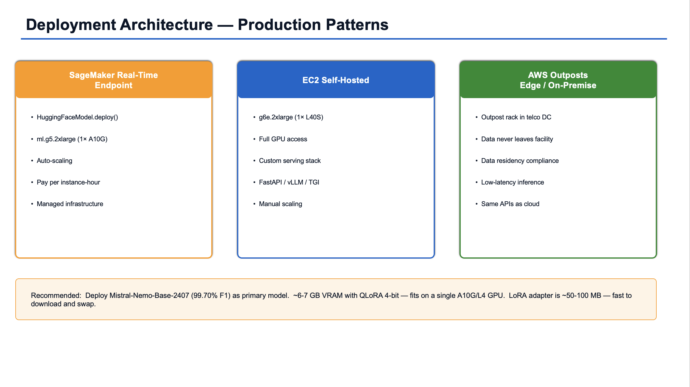

**AWS Services: Amazon SageMaker Endpoints, Amazon EC2, AWS Outposts**

Based on the benchmark results, deploy Mistral-Nemo as the primary model for 3GPP RCA:

#### 9.1 SageMaker Real-Time Endpoint

```python
from sagemaker.huggingface import HuggingFaceModel

model = HuggingFaceModel(model_data="s3://your-telco-llm-bucket/adapters/ministral/",
                          role="arn:aws:iam::ACCOUNT_ID:role/SageMakerRole",
                          transformers_version="4.46.1", pytorch_version="2.3.0")
predictor = model.deploy(instance_type="ml.g5.2xlarge", initial_instance_count=1)
result = predictor.predict({"inputs": log_text})
```

#### 9.2 EC2 Self-Hosted

```python
from transformers import AutoModelForCausalLM, AutoTokenizer
from peft import PeftModel

base = AutoModelForCausalLM.from_pretrained("mistralai/Mistral-Nemo-Base-2407",
                                             torch_dtype="bfloat16", device_map="auto")
model = PeftModel.from_pretrained(base, "./ministral-3-14b-lora-adapter")

def infer(log_text):
    inputs = tokenizer(log_text, return_tensors="pt").to("cuda")
    return model.generate(**inputs, max_new_tokens=256)
```

#### 9.3 AWS Outposts and Edge

Deploy the EC2 instance on an [AWS Outpost](https://aws.amazon.com/outposts/) rack inside the operator's data center. The model runs on-premise with no data leaving the facility, meeting data residency requirements.

---

### 10. Generate Reports
[↑ Back to Table of Contents](#table-of-contents)

**Output: HTML report and JavaScript-based PPT presentation**

After scoring, generate visual reports from `results.json` for sharing and presentation.

#### 10.1 HTML Report

```bash
python3 src/report_html.py
# Output: reports/report.html
```

#### 10.2 JavaScript PPT Presentation

```bash
npm install pptxgenjs
node src/report_ppt.js
# Output: reports/presentation.pptx
```

Upload to S3:

```bash
aws s3 cp reports/ s3://your-telco-llm-bucket/reports/ --recursive
```

---

## Glossary - Concepts and Acronyms
[↑ Back to Table of Contents](#table-of-contents)

### Models and Architecture

**LLM (Large Language Model)** — A neural network trained on massive, broad datasets to understand and generate language across a wide range of topics. Requires significant compute to train and serve. Excels at general knowledge but can hallucinate on domain-specific queries. Examples: Claude, GPT-4, Amazon Nova Pro.

**SLM (Small Language Model)** — A smaller, more efficient language model (typically 1B–14B parameters) trained or fine-tuned on domain-specific datasets. Requires fewer resources to train and deploy, making it practical for edge devices and on-premise infrastructure. Excels in its target domain but has narrower general knowledge. Examples: Mistral-Nemo-Base-2407, Qwen3-14B, Gemma-3-12B.

**LLM vs SLM — Key Differences**

| Dimension | LLM | SLM |
|---|---|---|
| Training data | Broad, internet-scale datasets | Smaller, domain-specific datasets |
| Parameter count | Hundreds of billions | Billions (1B–14B typical) |
| Training cost | Very high (thousands of GPUs) | Significantly lower |
| Inference cost | High (pay-per-token via managed APIs) | Low (self-hosted on a single GPU) |
| General knowledge | Broad and deep | Narrow, focused on target domain |
| Domain accuracy | Can hallucinate on niche queries | High accuracy after fine-tuning |
| Deployment | Cloud API (Bedrock, OpenAI) | Edge, on-premise, SageMaker endpoint |
| Customization | Prompt engineering preferred | Fast to fine-tune with LoRA/QLoRA |

> In this benchmark, fine-tuned SLMs are evaluated against frontier LLMs on 3GPP RCA to determine whether domain fine-tuning can close the accuracy gap at a fraction of the inference cost.

**14B** — 14 billion parameters. More parameters generally means more capability but also more memory and compute.

**Foundation Model / Frontier Model** — A large pre-trained model (like Claude or Nova Pro) usable as-is for many tasks. "Frontier" refers to the most capable, state-of-the-art versions.

### Fine-Tuning

**Fine-Tuning** — Continuing to train a pre-trained model on a smaller, task-specific dataset to specialize it.

**LoRA (Low-Rank Adaptation)** — A parameter-efficient fine-tuning technique that adds small trainable matrices to specific layers instead of updating all weights. Dramatically reduces memory and training time.

**QLoRA (Quantized LoRA)** — LoRA with 4-bit quantized base model weights. Allows fine-tuning large models on less GPU memory.

**BF16 (Brain Float 16)** — A 16-bit floating point format that uses 8 exponent bits and 7 mantissa bits. Preferred for ML training because it covers the same numeric range as FP32 while halving memory usage. Maintains numerical stability better than FP16 for gradient updates.

**FP16 (Float 16 / Half Precision)** — A 16-bit floating point format with 5 exponent bits and 10 mantissa bits. Offers more precision than BF16 but a narrower numeric range, making it more prone to overflow/underflow during training. Often used with loss scaling to compensate.

**NF4 (4-bit NormalFloat)** — The quantization format used by QLoRA via `bitsandbytes`. Optimally distributes 4-bit values assuming normally distributed weights, reducing model memory from ~28GB (FP16) to ~7GB for a 14B model. Base weights stay frozen in NF4 while LoRA adapters train in BF16.

### Prompting Strategies

**Zero-Shot** — Asking the model to perform a task with no examples — just the instruction and input.

**Few-Shot** — Providing a small number of input/output examples (here: 5) before the actual input.

**CoT (Chain-of-Thought)** — Encouraging the model to reason step-by-step before giving a final answer.

### Evaluation Metrics

**F1 Score** — Harmonic mean of Precision and Recall. 1.0 is perfect; 0.0 is worst.

**Precision** — Of all predicted labels, what fraction were correct? High precision = few false alarms.

**Recall** — Of all actual labels, what fraction did the model find? High recall = few missed errors.

**Exact Match** — Percentage of test cases where the model's output exactly matched the expected output.

**Ground-Truth Test Set** — `data/test.jsonl` (992 examples). Each entry has a `log` field and a known correct `root_cause` label.

### Telco and 3GPP Concepts

**3GPP** — The international standards body defining mobile network specifications (4G LTE, 5G).

**5G SA (5G Standalone)** — A 5G network operating independently of 4G infrastructure with a cloud-native 5G core.

**NAS** — Non-Access Stratum protocol handling signaling between UE and core network (authentication, session management, mobility).

**NGAP** — Next Generation Application Protocol between 5G radio access network (gNB) and 5G core (AMF).

**RRC** — Radio Resource Control protocol managing radio connections between UE and base station.

**RCA (Root Cause Analysis)** — Identifying the original source of a failure, as opposed to symptoms or secondary effects.

**Sympathetic Noise** — Secondary failures triggered as a consequence of a root cause failure (heartbeat timeouts, keepalive failures, cascading errors). Filtering these is critical to accurate RCA.

### Infrastructure and Cost

**ml.g5.2xlarge** — SageMaker instance with 1× NVIDIA A10G GPU (24GB VRAM). Used for Mistral-Nemo and Gemma.

**ml.g5.12xlarge** — SageMaker instance with 4× NVIDIA A10G GPUs (96GB total). Used for Qwen3-14B.

**LoRA Adapter** — The small set of trained weights produced by LoRA fine-tuning. Saved separately and loaded on top of the base model at inference time.

**Amazon Bedrock** — AWS managed service for accessing foundation models via API. Pay per token.

**Amazon SageMaker Training Jobs** — Managed service for ML training. Handles provisioning, running, and terminating instances automatically.

**AWS Outposts** — AWS infrastructure extended to on-premise data centers for data residency and low-latency requirements.

### AWS Services

**Amazon S3** — Object storage for datasets, adapters, and results.

**IAM Role** — AWS identity with specific permissions. Assigned to SageMaker jobs for secure access to S3 and Bedrock.

**boto3** — Official AWS SDK for Python.

### ML Libraries and Tools

**PyTorch** — Open-source deep learning framework developed by Meta that provides tensor computation with GPU acceleration and automatic differentiation for building and training neural networks. All models in this benchmark (Mistral-Nemo, Qwen3, Gemma) run on PyTorch. The Hugging Face ecosystem (`transformers`, `peft`, `trl`, `accelerate`) is built on top of it. This benchmark pins `pytorch_version="2.3.0"` with CUDA 12.1 (`cu121`) to avoid the CUBLAS regression in newer builds.

**Hugging Face** — Open-source platform hosting pre-trained ML models and providing the core ML libraries used in this benchmark (`transformers`, `peft`, `trl`, `datasets`, `accelerate`).

**`transformers`** — Hugging Face's core library. Loads pre-trained models (Mistral-Nemo, Qwen3, Gemma), handles tokenization, and provides `TrainingArguments` for configuring fine-tuning jobs. The backbone everything else plugs into.

**`peft` (Parameter-Efficient Fine-Tuning)** — Provides `LoraConfig` and `get_peft_model` to apply LoRA/QLoRA adapters. Instead of fine-tuning all 14B parameters, it trains small rank-decomposition matrices (~0.5-2% of weights), making fine-tuning feasible on a single A10G GPU.

**`trl` (Transformer Reinforcement Learning)** — Used here for `SFTTrainer` (Supervised Fine-Tuning). Wraps the Hugging Face Trainer with SFT-specific features like dataset formatting, packing, and completion-only training masks.

**`datasets`** — Hugging Face's data loading library. Reads JSONL training files (`train.jsonl`, `test.jsonl`) into a streaming-friendly format that integrates directly with `SFTTrainer`. Handles shuffling, batching, and train/test splits.

**`accelerate`** — Handles distributed training and mixed-precision (BF16/FP16) across GPUs. On `ml.g5.12xlarge` (4x A10G) for Qwen3, it manages multi-GPU data parallelism. On single-GPU instances, it handles device placement and gradient accumulation.

**`bitsandbytes`** — Provides 4-bit quantization for QLoRA. Loads base model weights in NF4 format, reducing VRAM from ~28GB (FP16) to ~7GB. This is what makes fine-tuning 14B models possible on 24GB A10G GPUs.

**`huggingface_hub`** — Handles authentication and model downloads from the Hugging Face Hub. Required for gated models like Gemma 3 that need an accepted license agreement. Also used by SageMaker DLC containers to pull model weights during training/inference.

**`scikit-learn`** — Used in `src/evaluate.py` for computing classification metrics: F1 score, precision, recall, and exact match. Specifically `f1_score`, `precision_score`, `recall_score` with `average='weighted'` for multi-class evaluation across the 8 failure types.

**TRL** — Transformer Reinforcement Learning library providing `SFTTrainer` for supervised fine-tuning.

**PEFT** — Parameter-Efficient Fine-Tuning library implementing LoRA and QLoRA.

**CUDA** — NVIDIA's parallel computing platform for GPU computation. CUDA versions are bundled with PyTorch as `cuXXX` suffixes (e.g., `cu121` = CUDA 12.1, `cu128` = CUDA 12.8). PyTorch 2.10 built with CUDA 12.8 (`cu128`) introduced a CUBLAS regression. CUBLAS (CUDA Basic Linear Algebra Subroutines) is NVIDIA's GPU-accelerated library for matrix operations — the core math behind every forward pass, backward pass, and weight update in neural network training. The regression caused CUBLAS to produce silent numerical errors during BF16/FP16 matrix multiplications, meaning training would run without crashing but produce corrupted gradients and garbage model weights. PyTorch 2.3.0 with CUDA 12.1 (`cu121`) is unaffected. This benchmark pins `pytorch_version="2.3.0"` to use the `cu121` build and avoid the issue entirely.

---

> **Execution Log:** For the complete execution history including all failed experiments (Options B, C), intermediate results, debugging details, and the full Qwen3 optimization journey, see [EXECUTION-LOG.md](EXECUTION-LOG.md).
