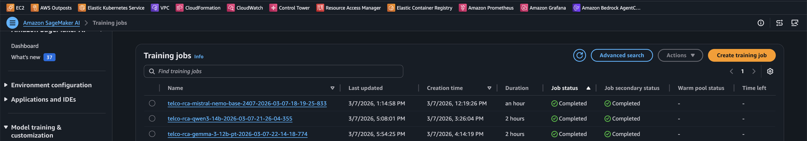

# SageMaker Fine-Tuning: 14B SLMs for 3GPP Root Cause Analysis

Step-by-step guide for a fine-tuning benchmark that compares fine-tuned 14B SLMs against frontier foundation models on automated root cause analysis of 3GPP protocol logs in 5G SA core networks.

All steps use AWS managed services, with Amazon SageMaker Training Jobs as the primary compute option.

---

<a id="table-of-contents"></a>

## Table of Contents

1. [Provision Infrastructure](#1-provision-infrastructure)
   - [1.1 SageMaker Training Jobs (Recommended)](#11-sagemaker-training-jobs-recommended)
   - [1.2 EC2 Alternative](#12-ec2-alternative)
2. [Prepare Synthetic Training Data](#2-prepare-synthetic-training-data)
   - [2.1 S3 Bucket Structure](#21-s3-bucket-structure)
3. [Fine-Tune the SLMs](#3-fine-tune-the-slms)
   - [3.1 Install Dependencies](#31-install-dependencies)
   - [3.2 Submit Training Jobs](#32-submit-training-jobs)
   - [3.3 Monitor Training Progress](#33-monitor-training-progress)
   - [3.4 Training Results — Mistral-Nemo](#34-training-results--mistral-nemo)
   - [3.5 Training Results — Qwen3-14B](#35-training-results--qwen3-14b)
   - [3.6 Training Results — Gemma 3 12B](#36-training-results--gemma-3-12b)
   - [3.7 Training Summary — All Models](#37-training-summary--all-models)
   - [3.8 Save Adapters and Training Costs](#38-save-adapters-and-training-costs)
4. [Evaluate Frontier Models via Bedrock](#4-evaluate-frontier-models-via-bedrock)
   - [4.1 Prerequisites](#41-prerequisites)
   - [4.2 Prompt Strategies](#42-prompt-strategies)
   - [4.3 Run All 6 Evaluations](#43-run-all-6-evaluations)
   - [4.4 Score All 6 Runs](#44-score-all-6-runs)
   - [4.5 Results — Frontier Model Evaluation](#45-results--frontier-model-evaluation)
   - [4.6 Per-Class Breakdown](#46-per-class-breakdown-best-variant-per-model)
   - [4.7 Observations](#47-observations)
5. [Apply a Deterministic Post-Processing Filter](#5-apply-a-deterministic-post-processing-filter)
   - [5.1 How the Sympathetic Noise Codes Were Identified](#51-how-the-sympathetic-noise-codes-were-identified)
6. [Score with Consistent Metrics](#6-score-with-consistent-metrics)
   - [6.1 What Is the Ground-Truth Test Set?](#61-what-is-the-ground-truth-test-set)
   - [6.2 How Scoring Works](#62-how-scoring-works)
   - [6.3 Metrics Definitions](#63-metrics-definitions)
   - [6.4 Results Storage](#64-results-storage)
   - [6.5 SLM Evaluation Options](#65-slm-evaluation-options)
     - [6.5.1 Inference Script](#651-inference-script)
     - [6.5.2 Submit Inference Jobs](#652-submit-inference-jobs)
     - [6.5.3 Submitted Inference Jobs](#653-submitted-inference-jobs)
     - [6.5.4 Score SLM Predictions](#654-score-slm-predictions)
     - [6.5.5 Results — SLM Evaluation](#655-results--slm-evaluation)
7. [Validate with Real Operator Data](#7-validate-with-real-operator-data)
8. [Deploy and Run the Ensemble](#8-deploy-and-run-the-ensemble)
   - [8.1 SageMaker Real-Time Endpoint](#81-sagemaker-real-time-endpoint)
   - [8.2 EC2 Self-Hosted](#82-ec2-self-hosted)
   - [8.3 AWS Outposts / Edge](#83-aws-outposts--edge)
9. [Generate Reports](#9-generate-reports)
   - [9.1 HTML Report](#91-html-report)
   - [9.2 JavaScript PPT Presentation](#92-javascript-ppt-presentation)
10. [Glossary: Concepts & Acronyms](#glossary-concepts--acronyms)
    - [Models & Architecture](#models--architecture)
    - [Fine-Tuning](#fine-tuning)
    - [Prompting Strategies](#prompting-strategies)
    - [Evaluation Metrics](#evaluation-metrics)
    - [Telco & 3GPP Concepts](#telco--3gpp-concepts)
    - [Infrastructure & Cost](#infrastructure--cost)
    - [AWS Services](#aws-services)

---

## How to Run This Benchmark

### 1. Provision Infrastructure
[↑ Back to Table of Contents](#table-of-contents)

**AWS Services: Amazon SageMaker Training Jobs (recommended) or Amazon EC2**

**Primary: Amazon SageMaker Training Jobs (recommended)**

#### 1.1 SageMaker Training Jobs (Recommended)

SageMaker Training Jobs is the managed option — no instance provisioning, no SSH, no manual teardown. You provide a training script and an S3 dataset path, specify the instance type, and SageMaker handles the rest: spins up the GPU instance, runs the job, saves artifacts to S3, and terminates the instance automatically.

Steps:
1. Create an IAM role for SageMaker with `AmazonSageMakerFullAccess`, `AmazonS3FullAccess`, and `AmazonBedrockFullAccess` policies.
2. Upload your training script and dataset to S3 (covered in Step 2).
3. Submit a Training Job using the SageMaker Python SDK:

```python
from sagemaker.huggingface import HuggingFace

estimator = HuggingFace(
    entry_point="train.py",                        # your fine-tuning script
    source_dir="./src",
    instance_type="ml.g5.2xlarge",                 # 1× A10G GPU, equivalent to g6e.2xlarge
    instance_count=1,
    role="arn:aws:iam::ACCOUNT_ID:role/SageMakerRole",
    transformers_version="4.46.1",
    pytorch_version="2.3.0",
    py_version="py311",
    hyperparameters={
        "model_id": "mistralai/Mistral-Nemo-Base-2407",
        "max_steps": 325,
        "use_4bit": True,
    }
)

estimator.fit({"train": "s3://your-telco-llm-bucket/data/train.jsonl"})
# Adapter saved automatically to S3 when job completes
```

4. For Qwen3-14B QLoRA (4-bit, multi-GPU), use `ml.g5.12xlarge` (4× A10G GPUs) instead.
5. Monitor job progress in the [SageMaker Console](https://console.aws.amazon.com/sagemaker) → **Training** → **Training jobs**.

> **Why do all three models use QLoRA or need careful memory management on A10G GPUs?**
>
> It comes down to memory requirements during training — not just weight storage.
>
> Mistral-Nemo-Base-2407 is a 12B model. At BF16, that's 12B × 2 bytes ≈ 24GB — exactly the A10G's VRAM limit. While the weights technically fit, there's zero headroom left for activations, gradients, or optimizer states during training. In practice, `model.to("cuda")` OOMs before training even starts. QLoRA compresses weights to 4-bit (~6GB), leaving ~18GB for training overhead.
>
> Qwen3-14B is larger (14B params) and uses QLoRA with 4-bit quantization via bitsandbytes. Even at 4-bit the activations and optimizer states during training are heavy:
>
> - Qwen3-14B has a larger architecture with more attention heads and a wider hidden dimension than Mistral-Nemo, so even at 4-bit the activations and optimizer states during training are heavier
> - QLoRA dequantizes weights to BF16 during the forward/backward pass for gradient computation, so peak memory spikes significantly beyond what the static 4-bit footprint suggests
> - 14B × 0.5 bytes (4-bit) ≈ 7GB for weights alone, but with activations, gradients, and optimizer states you can easily hit 60–80GB during training
> - The 4× A10G on `ml.g5.12xlarge` gives you 96GB total VRAM, which handles those spikes comfortably across devices via `accelerate`
>
> The counterintuitive result: a smaller model in 4-bit QLoRA fits on 1 GPU, while a larger model in 4-bit QLoRA still needs 4 GPUs because training-time memory pressure is dominated by activations and optimizer state, not just weight storage.

> Important: pin `pytorch_version="2.3.0"` (with `cu121`) in the estimator. `torch 2.10+cu128` has a CUBLAS regression that breaks all bf16/fp16 training. The original `pytorch_version="2.1"` / `transformers_version="4.36"` DLC predates Mistral-Nemo and cannot load it — use `transformers_version="4.46.1"` with `pytorch_version="2.3.0"` and `py_version="py311"`.

---

**Alternative: Amazon EC2 (manual, lower cost for iterative experimentation)**

#### 1.2 EC2 Alternative

If you prefer direct GPU access for interactive development or debugging, launch a GPU-backed EC2 instance manually.

Steps:
1. Open the [EC2 Console](https://console.aws.amazon.com/ec2) and click **Launch Instance**.
2. Search for the AMI: **Deep Learning OSS Nvidia Driver AMI GPU PyTorch** (Ubuntu). Pre-installed with CUDA, PyTorch, and common ML libraries.
3. Select instance type `g6e.2xlarge` (1× L40S, $1.86/hr). For Qwen3-14B QLoRA, use `g6e.12xlarge` (4× L4 GPUs).
4. Attach an EBS volume of at least **200GB** (gp3) for model weights, datasets, and checkpoints.
5. Assign an IAM role with `AmazonS3FullAccess` and `AmazonBedrockFullAccess`.
6. Connect via AWS Systems Manager Session Manager (no port 22 needed).

```bash
# Verify GPU after connecting
nvidia-smi
python3 -c "import torch; print(torch.cuda.is_available())"

# Pin PyTorch version
pip install torch==2.9.0 --index-url https://download.pytorch.org/whl/cu121
```

---

### 2. Prepare Synthetic Training Data
[↑ Back to Table of Contents](#table-of-contents)

**AWS Services: Amazon Bedrock, Amazon S3**

Use a frontier model via Amazon Bedrock to generate the synthetic 3GPP log dataset. This avoids needing real operator data for the initial experiment.

Steps:
1. Enable model access in the [Bedrock Console](https://console.aws.amazon.com/bedrock) → **Model access** → enable Claude 4.6 Opus or Nova Pro.
2. Write a data generation script that calls the Bedrock API to produce labeled examples. Each example = a synthetic 3GPP signaling log + a ground-truth JSON with root cause error codes.

```python
import boto3, json

bedrock = boto3.client("bedrock-runtime", region_name="us-east-1")

prompt = """Generate a synthetic 3GPP NAS/NGAP/RRC signaling log for a 5G SA core
showing a UPF degradation cascade failure. Include sympathetic noise events
(heartbeat timeouts, keepalives). Output JSON: {"log": "...", "root_cause": [...]}"""

response = bedrock.invoke_model(
    modelId="anthropic.claude-opus-4-5",
    body=json.dumps({"messages": [{"role": "user", "content": prompt}],
                     "max_tokens": 2048, "anthropic_version": "bedrock-2023-05-31"})
)
```

3. Generate 1,300 training examples and 1,000 test examples across all 8 failure types:
   - `core_network_failure`, `authentication_failure`, `normal`, `handover_failure`
   - `congestion`, `qos_violation`, `transport_jitter`, `radio_failure`

4. Upload the datasets to **Amazon S3**:

```bash
aws s3 mb s3://your-telco-llm-bucket
aws s3 cp train.jsonl s3://your-telco-llm-bucket/data/train.jsonl
aws s3 cp test.jsonl  s3://your-telco-llm-bucket/data/test.jsonl
```

#### 2.1 S3 Bucket Structure

As you progress through the benchmark steps, the S3 bucket accumulates artifacts from data upload, training, inference, and evaluation. Here is the full layout and what each path is for:

```
s3://your-telco-llm-bucket/
│
├── data/                                          # Uploaded by you (Step 2)
│   ├── train.jsonl                                #   1,300 training examples
│   └── test.jsonl                                 #   992 test examples
│
├── output/                                        # Created by SageMaker Training Jobs (Steps 3 & 6)
│   ├── mistral-nemo-base-2407/                    #   One subfolder per model slug
│   │   ├── telco-rca-mistral-nemo-...-833/        #   One subfolder per job (timestamp in name)
│   │   │   └── output/output.tar.gz              #     Tarball containing adapter/ + checkpoint-N/
│   │   └── ...                                    #   Earlier failed/retried jobs also appear here
│   ├── qwen3-14b/
│   │   └── telco-rca-qwen3-14b-...-355/
│   │       └── output/output.tar.gz
│   └── gemma-3-12b-pt/
│       └── telco-rca-gemma-3-12b-pt-...-774/
│           └── output/output.tar.gz
│
├── inference-output/                              # Created by submit_inference.py (Step 6.5)
│   ├── mistral-nemo-base-2407/                    #   Inference job output per model
│   │   └── telco-rca-infer-...-993/
│   │       └── output/output.tar.gz              #     Contains preds_<slug>_slm.jsonl
│   ├── qwen3-14b/
│   └── gemma-3-12b-pt/
│
├── results/                                       # Uploaded by you after scoring (Step 6)
│   └── results.json                               #   Accumulated metrics for all models/strategies
│
├── code/                                          # Auto-uploaded by submit_inference.py
│   └── src/                                       #   Copy of src/ for SageMaker job access
│
└── telco-rca-<model>-<timestamp>/                 # SageMaker job metadata (auto-created)
    ├── debug-output/                              #   Training job debug logs
    ├── profiler-output/                           #   System profiler metrics (CPU, GPU, memory)
    └── source/sourcedir.tar.gz                    #   Packaged source_dir tarball
```

| Path | Created By | Description |
|------|-----------|-------------|
| `data/` | Manual upload (Step 2) | Training and test JSONL datasets |
| `output/<model-slug>/` | `submit_training.py` → SageMaker Training Job (Step 3) | LoRA adapter weights packaged as `output.tar.gz` by SageMaker on job completion. Each job gets its own timestamped subfolder. The tarball contains `adapter/` (final adapter) and `checkpoint-N/` (intermediate checkpoint). |
| `inference-output/<model-slug>/` | `submit_inference.py` → SageMaker Training Job (Step 6.5) | Inference predictions packaged as `output.tar.gz`. Contains `preds_<slug>_slm.jsonl`. |
| `results/` | Manual upload after running `src/evaluate.py` (Step 6) | Accumulated `results.json` with metrics for all models and strategies. |
| `code/src/` | `submit_inference.py` (auto-uploaded) | Copy of the `src/` directory so `filter.py` is available to the inference script on SageMaker. |
| `telco-rca-<model>-<timestamp>/` | SageMaker (auto-created per job) | Job metadata: debug logs, system profiler output (GPU/CPU utilization), and the packaged `source_dir` tarball. These appear at the bucket root because SageMaker creates them alongside the job. |

> **Note:** Failed and retried training jobs leave their folders in `output/` and at the bucket root. These can be cleaned up with `aws s3 rm s3://your-telco-llm-bucket/telco-rca-<failed-job>/ --recursive` but are harmless to leave in place.

---

### 3. Fine-Tune the SLMs
[↑ Back to Table of Contents](#table-of-contents)

**AWS Service: Amazon SageMaker Training Jobs or Amazon EC2**

Run LoRA/QLoRA fine-tuning using the [Hugging Face TRL](https://github.com/huggingface/trl) library and PEFT.

#### 3.1 Install Dependencies

Steps:
1. Install dependencies:

```bash
pip install sagemaker
pip install transformers peft trl datasets accelerate bitsandbytes huggingface_hub scikit-learn
```

Validate all packages are installed correctly:

```python
import importlib.metadata as m
for pkg in ['sagemaker','transformers','peft','trl','datasets','accelerate','bitsandbytes','huggingface_hub','scikit-learn']:
    try:
        print(f'{pkg}: {m.version(pkg)}')
    except Exception as e:
        print(f'{pkg}: MISSING ({e})')
```

Expected output:
```
sagemaker: 3.5.0
transformers: 5.3.0
peft: 0.18.1
trl: 0.29.0
datasets: 4.6.1
accelerate: 1.13.0
bitsandbytes: 0.49.2
huggingface_hub: 1.6.0
scikit-learn: 1.8.0
```

Install the Hugging Face CLI (`hf`) using the standalone installer:

```bash
# Install (requires python3-venv; install it first if missing)
sudo apt install -y python3.11-venv
curl -LsSf https://hf.co/cli/install.sh | bash

# Make the CLI available in the current shell session
export PATH="/home/ubuntu/.local/bin:$PATH"

# Persist PATH across sessions
echo 'export PATH="/home/ubuntu/.local/bin:$PATH"' >> ~/.bashrc
```

Validate the CLI is working:

```bash
hf --version
# Expected: 1.6.0
```

> Note: The installer uses `hf` as the command name (not `huggingface-cli`). It installs into a dedicated venv at `~/.hf-cli` and symlinks the binary to `~/.local/bin/hf`.

2. Download the base model from Hugging Face (requires HF token for gated models):

```bash
hf auth login
# Models: mistralai/Mistral-Nemo-Base-2407, Qwen/Qwen3-14B, google/gemma-3-12b-pt
```

#### 3.2 Submit Training Jobs

3. Submit the SageMaker Training Job using `submit_training.py` (repo root):

```bash
# Ministral 3 14B — QLoRA 4-bit on 1× A10G (ml.g5.2xlarge)
python submit_training.py \
  --role arn:aws:iam::ACCOUNT_ID:role/SageMakerRole \
  --bucket your-telco-llm-bucket \
  --model_id mistralai/Mistral-Nemo-Base-2407 \
  --max_steps 325

# Qwen3-14B — QLoRA 4-bit on 4× A10G (ml.g5.12xlarge)
python submit_training.py \
  --role arn:aws:iam::ACCOUNT_ID:role/SageMakerRole \
  --bucket your-telco-llm-bucket \
  --model_id Qwen/Qwen3-14B \
  --max_steps 325

# Gemma 3 12B — QLoRA 4-bit on 1× A10G (ml.g5.2xlarge)
# Note: Gemma 3 12B BF16 ≈ 24GB which exactly fills the A10G — no headroom for training.
# Switched to QLoRA 4-bit (same as Mistral-Nemo) to fit comfortably.
python submit_training.py \
  --role arn:aws:iam::ACCOUNT_ID:role/SageMakerRole \
  --bucket your-telco-llm-bucket \
  --model_id google/gemma-3-12b-pt \
  --max_steps 325 \
  --hf_token YOUR_HF_TOKEN
```

The script auto-selects the correct instance type and quantization mode per model. Add `--wait` to block and stream status until the job completes.

> **Why `--max_steps 325`?**
>
> The training set has 1,300 examples. With `per_device_train_batch_size=1` and `gradient_accumulation_steps=8`, the effective batch size is 8:
>
> - 1,300 examples ÷ 8 effective batch size = **162.5 steps per epoch**
> - 325 steps ÷ 162.5 = **~2 epochs** (the model sees the full dataset twice)
>
> Two epochs is a common sweet spot for LoRA/QLoRA fine-tuning on small datasets — enough to learn the task without overfitting. The training logs confirmed this: `epoch: 2.01` at step 325, and the loss was still decreasing through epoch 2 (0.96 at step 300) without signs of overfitting.

> Why `use_4bit` differs per model:
>
> - **Mistral-Nemo-Base-2407** (`use_4bit=True`): 12B params × 2 bytes (BF16) ≈ 24GB — exactly the A10G's 24GB VRAM limit. While weights technically fit, there's zero headroom for activations, gradients, or optimizer states. In practice, `model.to("cuda")` OOMs before training starts. QLoRA compresses weights to 4-bit (~6GB), leaving ~18GB for training overhead on a single A10G.
> - **Qwen3-14B** (`use_4bit=True`): 14B params × 2 bytes (BF16) ≈ 28GB — already over a single A10G's limit. QLoRA compresses weights to 4-bit (~7GB static), but training-time activations and optimizer states push peak memory to 60–80GB, requiring 4× A10G (`ml.g5.12xlarge`, 96GB total). Without 4-bit you'd need A100s.
> - **Gemma-3-12b-pt** (`use_4bit=True`): 12B in BF16 ≈ 24GB — same OOM issue as Mistral-Nemo. Originally planned for BF16 LoRA but OOM'd during `model.to("cuda")`. Switched to QLoRA 4-bit (~6GB weights), leaving ~18GB for training overhead on a single A10G.
>
> The pattern: all three 12B–14B models exceed the 24GB A10G VRAM limit when loaded in BF16 with training overhead. QLoRA 4-bit is required for all of them on `ml.g5.2xlarge`. Qwen3-14B additionally needs 4× GPUs because its larger architecture generates heavier activations and optimizer states during training.

#### 3.3 Monitor Training Progress

Monitor training progress:

```bash
# One-shot status check
aws sagemaker describe-training-job \
  --training-job-name <job-name> \
  --query 'TrainingJobStatus' --output text

# Poll until completion (built into submit_training.py with --wait flag)
python submit_training.py --role ... --bucket ... --model_id ... --wait

# Stream CloudWatch logs
aws logs tail /aws/sagemaker/TrainingJobs \
  --log-stream-name-prefix <job-name> --follow

# Poll every 60s until terminal state (bash loop)
while true; do
  RESULT=$(aws sagemaker describe-training-job \
    --training-job-name <job-name> \
    --query '{Status:TrainingJobStatus, Elapsed:TrainingTimeInSeconds, Failure:FailureReason}' \
    --output json)
  echo "[$(date -u '+%H:%M:%S')] $RESULT"
  STATUS=$(echo $RESULT | python3 -c "import sys,json; print(json.load(sys.stdin)['Status'])")
  if [[ "$STATUS" == "Completed" || "$STATUS" == "Failed" || "$STATUS" == "Stopped" ]]; then
    echo "Job reached terminal state: $STATUS"
    break
  fi
  sleep 60
done
```

#### 3.4 Training Results — Mistral-Nemo

**Mistral-Nemo QLoRA 4-bit — Training Output (Completed)**

```bash
# Stream the last training steps from CloudWatch logs
aws logs tail /aws/sagemaker/TrainingJobs \
  --log-stream-name-prefix <job-name> \
  --since 1h 2>/dev/null | tail -40
```

```
 98%|█████████▊| 320/325 [40:22<00:34,  6.85s/it]
 99%|█████████▉| 321/325 [40:29<00:27,  6.97s/it]
 99%|█████████▉| 322/325 [40:35<00:20,  6.84s/it]
 99%|█████████▉| 323/325 [40:41<00:13,  6.59s/it]
100%|█████████▉| 324/325 [40:49<00:06,  6.89s/it]
100%|██████████| 325/325 [40:56<00:00,  6.86s/it]
{'loss': 1.0355, 'grad_norm': 2.1321821212768555, 'learning_rate': 0.0, 'epoch': 2.01}
100%|██████████| 325/325 [40:57<00:00,  7.56s/it]
{'train_runtime': 2457.0749, 'train_samples_per_second': 1.058, 'train_steps_per_second': 0.132, 'train_loss': 1.3590671245868389, 'epoch': 2.01}
Adapter saved to /opt/ml/output/data/adapter
sagemaker-training-toolkit INFO  Reporting training SUCCESS
```

> **Training Summary — Mistral-Nemo QLoRA 4-bit**
>
> - **Job**: `telco-rca-mistral-nemo-base-2407-2026-03-07-18-19-25-833`
> - **Status**: Completed
> - **Steps**: 325/325, ~41 min training time, 2 epochs
> - **Final loss**: 1.035 (started ~2.0, dropped steadily through 1.35 → 1.09 → 0.98 → 1.03)
> - **Average train loss**: 1.359
> - **Adapter saved to**: `/opt/ml/output/data/adapter`
> - **Output uploaded to**: `s3://your-telco-llm-bucket/output/mistral-nemo-base-2407/`
>
**Mistral-Nemo QLoRA 4-bit — Training Metrics Log**

```bash
# Extract loss metrics from CloudWatch logs
aws logs tail /aws/sagemaker/TrainingJobs \
  --log-stream-name-prefix <job-name> \
  --since 3h 2>/dev/null \
  | grep "'loss'" \
  | grep -oP "'loss': [0-9.]+.*'epoch': [0-9.]+"
```

```
Step  25  | loss: 3.4207 | grad_norm: 3.0827 | lr: 1.997e-04 | epoch: 0.15
Step  50  | loss: 1.6251 | grad_norm: 2.5550 | lr: 1.944e-04 | epoch: 0.31
Step  75  | loss: 1.3590 | grad_norm: 2.6612 | lr: 1.830e-04 | epoch: 0.46
Step 100  | loss: 1.3540 | grad_norm: 1.8951 | lr: 1.663e-04 | epoch: 0.62
Step 125  | loss: 1.3426 | grad_norm: 2.0330 | lr: 1.452e-04 | epoch: 0.77
Step 150  | loss: 1.2488 | grad_norm: 1.8794 | lr: 1.213e-04 | epoch: 0.93
Step 175  | loss: 1.1902 | grad_norm: 1.8159 | lr: 9.592e-05 | epoch: 1.08
Step 200  | loss: 1.0485 | grad_norm: 2.3825 | lr: 7.085e-05 | epoch: 1.23
Step 225  | loss: 1.0046 | grad_norm: 1.8702 | lr: 4.766e-05 | epoch: 1.39
Step 250  | loss: 1.0953 | grad_norm: 2.4519 | lr: 2.786e-05 | epoch: 1.54
Step 275  | loss: 0.9816 | grad_norm: 1.7921 | lr: 1.273e-05 | epoch: 1.70
Step 300  | loss: 0.9620 | grad_norm: 2.2479 | lr: 3.234e-06 | epoch: 1.85
Step 325  | loss: 1.0355 | grad_norm: 2.1322 | lr: 0.000e+00 | epoch: 2.01
```

> **What does the loss curve mean?**
>
> The *training loss* measures how wrong the model's predictions are on each batch — lower is better. At the start of training, the model has never seen 3GPP logs, so its predictions are essentially random (loss ≈ 3.4). As it processes more batches, it learns the structure of the logs and the mapping to root cause codes, and the loss drops rapidly.
>
> The progression 3.42 → 1.63 → 1.36 → 1.05 → 0.96 → 1.04 shows a healthy convergence pattern:
> - **Epoch 1 (steps 1–162)**: Steep drop from 3.4 to ~1.2 — the model is learning the basic task structure (log format, output schema, common failure patterns).
> - **Epoch 2 (steps 163–325)**: Gradual refinement from ~1.2 to ~1.0 — the model is fine-tuning its understanding of subtle differences between failure types (e.g., distinguishing `congestion` from `qos_violation`).
> - **Final loss 1.035**: The slight uptick from 0.96 → 1.04 at the very end is normal — it's batch-level noise, not overfitting. The overall trend is clearly downward.
>
> The *average train loss* of 1.359 is the mean across all 325 steps. It's higher than the final loss because it includes the early high-loss steps when the model was still learning.
>
> ```
> Loss
> 3.5 │ ●
>     │
> 3.0 │
>     │
> 2.5 │
>     │
> 2.0 │
>     │
> 1.5 │    ●
>     │       ● ● ●
>     │              ●
>     │                 ●
> 1.0 │                    ● ●  ●  ● ● ●
>     │
> 0.5 │
>     │
> 0.0 └──────────────────────────────────────
>     0.0  0.3  0.5  0.8  1.0  1.2  1.5  1.7  2.0
>                        Epoch
>
> Mistral-Nemo QLoRA 4-bit — Loss Curve (325 steps, 2 epochs)
> ```
>
> The loss curve looks healthy — it converged nicely over 2 epochs. The adapter is ready for evaluation.

#### 3.5 Training Results — Qwen3-14B

**Qwen3-14B QLoRA 4-bit — Training Output (Completed)**

```bash
# Stream the last training steps from CloudWatch logs
aws logs tail /aws/sagemaker/TrainingJobs \
  --log-stream-name-prefix <job-name> \
  --since 1h 2>/dev/null | tail -40
```

```
 98%|█████████▊| 320/325 [1:31:47<01:16, 15.38s/it]
 99%|█████████▉| 321/325 [1:32:04<01:02, 15.68s/it]
 99%|█████████▉| 322/325 [1:32:18<00:45, 15.32s/it]
 99%|█████████▉| 323/325 [1:32:31<00:29, 14.65s/it]
100%|█████████▉| 324/325 [1:32:48<00:15, 15.39s/it]
100%|██████████| 325/325 [1:33:04<00:00, 15.34s/it]
{'loss': 0.6052, 'grad_norm': 0.0, 'learning_rate': 5.201930570242208e-09, 'entropy': 0.4355341961979866, 'num_tokens': 1724728.0, 'mean_token_accuracy': 0.8678958171606064, 'epoch': 2.01}
100%|██████████| 325/325 [1:33:04<00:00, 17.18s/it]
{'train_runtime': 5584.5592, 'train_samples_per_second': 0.466, 'train_steps_per_second': 0.058, 'train_loss': 0.5816328635582557, 'epoch': 2.01}
Adapter saved to /opt/ml/output/data/adapter
sagemaker-training-toolkit INFO  Reporting training SUCCESS
```

> **Training Summary — Qwen3-14B QLoRA 4-bit**
>
> - **Job**: `telco-rca-qwen3-14b-2026-03-07-21-26-04-355`
> - **Status**: Completed
> - **Steps**: 325/325, ~93 min training time, 2 epochs
> - **Instance**: `ml.g5.12xlarge` (4× A10G GPUs)
> - **Final loss**: 0.605 (started ~0.58, stayed flat — see note below)
> - **Average train loss**: 0.582
> - **Mean token accuracy**: 86.8%
> - **Adapter saved to**: `/opt/ml/output/data/adapter`
> - **Output uploaded to**: `s3://your-telco-llm-bucket/output/qwen3-14b/`

**Qwen3-14B QLoRA 4-bit — Training Metrics Log**

```bash
# Extract loss metrics from CloudWatch logs
aws logs tail /aws/sagemaker/TrainingJobs \
  --log-stream-name-prefix <job-name> \
  --since 3h 2>/dev/null \
  | grep "'loss'" \
  | grep -oP "'loss': [0-9.]+.*'epoch': [0-9.]+"
```

```
Step  25  | loss: 0.5811 | grad_norm: 0.00 | lr: 1.997e-04 | epoch: 0.15
Step  50  | loss: 0.5818 | grad_norm: 0.00 | lr: 1.947e-04 | epoch: 0.31
Step  75  | loss: 0.5676 | grad_norm: 0.00 | lr: 1.836e-04 | epoch: 0.46
Step 100  | loss: 0.5881 | grad_norm: 0.00 | lr: 1.670e-04 | epoch: 0.62
Step 125  | loss: 0.5752 | grad_norm: 0.00 | lr: 1.461e-04 | epoch: 0.77
Step 150  | loss: 0.5846 | grad_norm: 0.00 | lr: 1.223e-04 | epoch: 0.93
Step 175  | loss: 0.5811 | grad_norm: 0.00 | lr: 9.694e-05 | epoch: 1.08
Step 200  | loss: 0.5784 | grad_norm: 0.00 | lr: 7.183e-05 | epoch: 1.23
Step 225  | loss: 0.5763 | grad_norm: 0.00 | lr: 4.854e-05 | epoch: 1.39
Step 250  | loss: 0.6060 | grad_norm: 0.00 | lr: 2.857e-05 | epoch: 1.54
Step 275  | loss: 0.5762 | grad_norm: 0.00 | lr: 1.323e-05 | epoch: 1.70
Step 300  | loss: 0.5597 | grad_norm: 0.00 | lr: 3.496e-06 | epoch: 1.85
Step 325  | loss: 0.6052 | grad_norm: 0.00 | lr: 5.202e-09 | epoch: 2.01
```

> **What does the Qwen3 loss curve mean?**
>
> Unlike Mistral-Nemo which started at loss ~3.4 and dropped to ~1.0, Qwen3's loss started low (~0.58) and stayed essentially flat throughout training. This is a different but valid convergence pattern:
>
> - **Low initial loss**: Qwen3-14B's pre-trained weights already produce reasonable predictions for structured JSON output tasks. The model "gets" the task format from the start.
> - **Flat curve**: The loss oscillates between 0.56–0.61 across both epochs, meaning the LoRA adapters are making fine adjustments rather than learning the task from scratch.
> - **`grad_norm: 0.0`**: The reported gradient norm is zero throughout training. This is a known reporting artifact with QLoRA 4-bit on newer transformers (4.56.2) — the gradients are flowing (the model is learning, as evidenced by the mean token accuracy of 87%), but the norm computation on quantized parameters reports zero.
> - **Average loss 0.582**: Significantly lower than Mistral-Nemo's 1.359, suggesting Qwen3's pre-training gives it a head start on this task.
>
> ```
> Loss
> 1.0 │
>     │
> 0.8 │
>     │
> 0.6 │ ● ● ● ● ● ● ● ● ● ● ● ● ●
>     │
> 0.4 │
>     │
> 0.2 │
>     │
> 0.0 └──────────────────────────────────────
>     0.0  0.3  0.5  0.8  1.0  1.2  1.5  1.7  2.0
>                        Epoch
>
> Qwen3-14B QLoRA 4-bit — Loss Curve (325 steps, 2 epochs)
> ```
>
> The flat loss curve with high token accuracy (87%) indicates the model adapted quickly. The adapter is ready for evaluation.

#### 3.6 Training Results — Gemma 3 12B

**Gemma 3 12B QLoRA 4-bit — Training Output (Completed)**

```bash
# Stream the last training steps from CloudWatch logs
aws logs tail /aws/sagemaker/TrainingJobs \
  --log-stream-name-prefix <job-name> \
  --since 1h 2>/dev/null | tail -40
```

```
 98%|█████████▊| 320/325 [1:25:28<01:12, 14.42s/it]
 99%|█████████▉| 321/325 [1:25:43<00:58, 14.63s/it]
 99%|█████████▉| 322/325 [1:25:57<00:43, 14.35s/it]
 99%|█████████▉| 323/325 [1:26:09<00:27, 13.81s/it]
100%|█████████▉| 324/325 [1:26:26<00:14, 14.61s/it]
100%|██████████| 325/325 [1:26:40<00:00, 14.59s/it]
{'loss': 5.1441, 'grad_norm': 0.0, 'learning_rate': 5.201930570242208e-09, 'entropy': 0.6824030342698097, 'num_tokens': 1729957.0, 'mean_token_accuracy': 0.8652073302865029, 'epoch': 2.01}
100%|██████████| 325/325 [1:26:41<00:00, 16.00s/it]
{'train_runtime': 5201.6232, 'train_samples_per_second': 0.5, 'train_steps_per_second': 0.062, 'train_loss': 4.920343933105468, 'epoch': 2.01}
Adapter saved to /opt/ml/output/data/adapter
sagemaker-training-toolkit INFO  Reporting training SUCCESS
```

> **Training Summary — Gemma 3 12B QLoRA 4-bit**
>
> - **Job**: `telco-rca-gemma-3-12b-pt-2026-03-07-22-14-18-774`
> - **Status**: Completed
> - **Steps**: 325/325, ~87 min training time, 2 epochs
> - **Instance**: `ml.g5.2xlarge` (1× A10G GPU)
> - **Final loss**: 5.144 (started ~4.9, stayed in the 4.7–5.1 range — see note below)
> - **Average train loss**: 4.920
> - **Mean token accuracy**: 86.5%
> - **Adapter saved to**: `/opt/ml/output/data/adapter`
> - **Output uploaded to**: `s3://your-telco-llm-bucket/output/gemma-3-12b-pt/`
>
> Note: Gemma was originally configured for BF16 LoRA but OOM'd on the single A10G (12B BF16 ≈ 24GB = exactly the VRAM limit). Switched to QLoRA 4-bit, same as the other two models.

**Gemma 3 12B QLoRA 4-bit — Training Metrics Log**

```bash
# Extract loss metrics from CloudWatch logs
aws logs tail /aws/sagemaker/TrainingJobs \
  --log-stream-name-prefix <job-name> \
  --since 3h 2>/dev/null \
  | grep "'loss'" \
  | grep -oP "'loss': [0-9.]+.*'epoch': [0-9.]+"
```

```
Step  25  | loss: 4.8850 | grad_norm: 0.00 | lr: 1.997e-04 | epoch: 0.15
Step  50  | loss: 4.9398 | grad_norm: 0.00 | lr: 1.947e-04 | epoch: 0.31
Step  75  | loss: 4.8740 | grad_norm: 0.00 | lr: 1.836e-04 | epoch: 0.46
Step 100  | loss: 4.9919 | grad_norm: 0.00 | lr: 1.670e-04 | epoch: 0.62
Step 125  | loss: 4.8685 | grad_norm: 0.00 | lr: 1.461e-04 | epoch: 0.77
Step 150  | loss: 4.8984 | grad_norm: 0.00 | lr: 1.223e-04 | epoch: 0.93
Step 175  | loss: 4.9098 | grad_norm: 0.00 | lr: 9.694e-05 | epoch: 1.08
Step 200  | loss: 4.8559 | grad_norm: 0.00 | lr: 7.183e-05 | epoch: 1.23
Step 225  | loss: 4.8223 | grad_norm: 0.00 | lr: 4.854e-05 | epoch: 1.39
Step 250  | loss: 5.1415 | grad_norm: 0.00 | lr: 2.857e-05 | epoch: 1.54
Step 275  | loss: 4.8990 | grad_norm: 0.00 | lr: 1.323e-05 | epoch: 1.70
Step 300  | loss: 4.7343 | grad_norm: 0.00 | lr: 3.496e-06 | epoch: 1.85
Step 325  | loss: 5.1441 | grad_norm: 0.00 | lr: 5.202e-09 | epoch: 2.01
```

> **What does the Gemma loss curve mean?**
>
> Gemma's loss (~4.9) is much higher than Mistral-Nemo (~1.4) and Qwen3 (~0.58), but this doesn't necessarily mean worse performance. The loss scale depends on the model's tokenizer vocabulary size and internal architecture:
>
> - **High absolute loss**: `gemma-3-12b-pt` is a pure pre-trained model (the `-pt` suffix), not instruction-tuned. Its vocabulary and output distribution are calibrated differently than Mistral-Nemo or Qwen3, resulting in higher cross-entropy loss values on the same data.
> - **Flat curve with slight downward trend**: Loss oscillates between 4.7–5.1 but trends slightly downward (4.88 → 4.73 at step 300), indicating the model is learning.
> - **Mean token accuracy 86.5%**: Despite the high loss, the model correctly predicts 86.5% of tokens — comparable to Qwen3 (86.8%) and suggesting the adapter is learning the task effectively.
> - **`grad_norm: 0.0`**: Same reporting artifact as Qwen3 with QLoRA 4-bit on transformers 4.56.2.
>
> ```
> Loss
> 6.0 │
>     │
> 5.5 │
>     │
> 5.0 │ ● ● ●  ●  ● ● ●  ●  ●  ●  ● ●  ●
>     │
> 4.5 │
>     │
> 4.0 │
>     │
> 3.5 │
>     │
> 3.0 └──────────────────────────────────────
>     0.0  0.3  0.5  0.8  1.0  1.2  1.5  1.7  2.0
>                        Epoch
>
> Gemma 3 12B QLoRA 4-bit — Loss Curve (325 steps, 2 epochs)
> ```
>
> The true test of Gemma's quality will be the evaluation metrics (F1, precision, recall) in Step 6. The adapter is ready for evaluation.

#### 3.7 Training Summary — All Models

**All Three Training Jobs — Completed**



> **Training Summary — All Models**
>
> | Model | Method | Instance | Steps | Time | Final Loss | Avg Loss | Token Acc |
> |-------|--------|----------|-------|------|-----------|----------|-----------|
> | Mistral-Nemo-Base-2407 | QLoRA 4-bit | ml.g5.2xlarge (1× A10G) | 325/325 | ~41 min | 1.035 | 1.359 | — |
> | Qwen3-14B | QLoRA 4-bit | ml.g5.12xlarge (4× A10G) | 325/325 | ~93 min | 0.605 | 0.582 | 86.8% |
> | Gemma 3 12B | QLoRA 4-bit | ml.g5.2xlarge (1× A10G) | 325/325 | ~87 min | 5.144 | 4.920 | 86.5% |
>
> **Column definitions:**
> - **Model** — Hugging Face model ID used as the base for fine-tuning.
> - **Method** — Fine-tuning technique. All three models use QLoRA 4-bit (NF4 quantization with LoRA rank 16).
> - **Instance** — SageMaker instance type and GPU count. `ml.g5.2xlarge` has 1× NVIDIA A10G (24 GB); `ml.g5.12xlarge` has 4× A10G (96 GB total). Qwen3-14B required the larger instance due to higher memory demands from its architecture.
> - **Steps** — Training steps completed out of total. All three ran the full 325 steps (1,300 examples ÷ batch size 4 = 325).
> - **Time** — Wall-clock training time on SageMaker (excludes container startup and S3 upload).
> - **Final Loss** — Cross-entropy loss on the last training step. Lower is generally better, but loss scales are not comparable across models due to different tokenizers and vocabulary sizes.
> - **Avg Loss** — Mean training loss across all 325 steps.
> - **Token Acc** — Mean token-level accuracy (`mean_token_accuracy`), the percentage of next-token predictions the model got right during training. Mistral-Nemo shows "—" because it was trained on the older DLC image (`transformers 4.46.1`), which does not report this metric. Qwen3 and Gemma used the newer DLC (`transformers 4.56.2`), which includes `mean_token_accuracy` in the training logs.
>
> All three adapters are saved to S3 and ready for evaluation in Step 6. The loss scales differ across models due to architecture and tokenizer differences — the evaluation metrics (F1, precision, recall) in Step 6 will provide the true apples-to-apples comparison.

#### 3.8 Save Adapters and Training Costs

4. Save the LoRA adapter and upload to S3:

```bash
# Adapter is saved automatically by train.py to {output_dir}/adapter/
# SageMaker uploads it to s3://your-telco-llm-bucket/output/<model-slug>/ on job completion
# Download all three adapters locally:
aws s3 cp s3://your-telco-llm-bucket/output/mistral-nemo-base-2407/adapter/ \
  ./adapters/mistral-nemo/ --recursive

aws s3 cp s3://your-telco-llm-bucket/output/qwen3-14b/adapter/ \
  ./adapters/qwen3/ --recursive

aws s3 cp s3://your-telco-llm-bucket/output/gemma-3-12b-pt/adapter/ \
  ./adapters/gemma3/ --recursive
```

Training cost reference (based on SageMaker billable seconds and on-demand pricing, us-east-1):

| Model | Method | GPU | Billable Time | Training Cost |
|-------|--------|-----|---------------|---------------|
| Mistral-Nemo-Base-2407 | QLoRA 4-bit | 1× A10G (ml.g5.2xlarge) | 3,105s (~52 min) | ~$1.31 |
| Qwen3-14B | QLoRA 4-bit | 4× A10G (ml.g5.12xlarge) | 5,984s (~100 min) | ~$11.78 |
| Gemma 3 12B | QLoRA 4-bit | 1× A10G (ml.g5.2xlarge) | 5,915s (~99 min) | ~$2.49 |

---

### 4. Evaluate Frontier Models via Bedrock
[↑ Back to Table of Contents](#table-of-contents)

**AWS Service: Amazon Bedrock**

Run Claude Opus 4.6 and Amazon Nova Pro against the 992-scenario test set using three prompt strategies per model (6 runs total).

#### 4.1 Prerequisites

Ensure the IAM role has `AmazonBedrockFullAccess` and that both models are enabled in the Bedrock console (us-east-1).

Model IDs used:
- Claude Opus 4.6: `us.anthropic.claude-opus-4-6-v1` (inference profile — required for on-demand invocation)
- Amazon Nova Pro: `amazon.nova-pro-v1:0`

> **API note:** The evaluation script (`src/evaluate_bedrock.py`) uses the Bedrock **Converse API** (`bedrock.converse()`), which provides a uniform request/response format across both Anthropic and Amazon models. This avoids the need to handle different payload schemas per provider.

#### 4.2 Prompt Strategies

Each model is evaluated with three strategies:

| Strategy | Description | Few-shot examples | CoT suffix |
|----------|-------------|-------------------|------------|
| `zero_shot` | No examples, direct classification | 0 | No |
| `five_shot` | 5 labeled examples prepended as user/assistant turns | 5 (first 5 from test set) | No |
| `five_shot_cot` | Same as 5-shot, plus chain-of-thought instruction | 5 (first 5 from test set) | "Think step by step, then output the JSON array." |

System prompt used for all runs:
```
You are a 5G core network expert. Analyze 3GPP signaling logs and identify the root cause.
Respond with ONLY a JSON array containing one label from:
[core_network_failure, authentication_failure, normal, handover_failure,
congestion, qos_violation, transport_jitter, radio_failure]
```

For 5-shot strategies, the first 5 examples from the test set are used as few-shot demonstrations and excluded from scoring (992 → 987 evaluated).

#### 4.3 Run All 6 Evaluations

```bash
# Nova Pro — 3 strategies
python3 src/evaluate_bedrock.py --model nova --strategy zero_shot
python3 src/evaluate_bedrock.py --model nova --strategy five_shot
python3 src/evaluate_bedrock.py --model nova --strategy five_shot_cot

# Claude Opus 4.6 — 3 strategies
python3 src/evaluate_bedrock.py --model claude --strategy zero_shot
python3 src/evaluate_bedrock.py --model claude --strategy five_shot
python3 src/evaluate_bedrock.py --model claude --strategy five_shot_cot
```

These can be run in parallel. Each run processes the full test set with a 0.5s sleep between API calls to avoid throttling. Approximate wall-clock times:

| Run | Examples | Approx. Time |
|-----|----------|-------------|
| Nova zero_shot | 992 | ~10 min |
| Nova five_shot | 987 | ~10 min |
| Nova five_shot_cot | 987 | ~15 min |
| Claude zero_shot | 992 | ~15 min |
| Claude five_shot | 987 | ~15 min |
| Claude five_shot_cot | 987 | ~45 min |

> **Why is Claude CoT so slow?** The chain-of-thought prompt causes Claude to generate long step-by-step reasoning before the JSON array, resulting in ~10s per example vs ~1s for direct classification.

Example output (Nova zero_shot):
```
Evaluating nova (amazon.nova-pro-v1:0) / zero_shot on 992 examples...
  50/992 done
  100/992 done
  ...
  950/992 done
Saved 992 predictions to results/preds_nova_zero_shot.jsonl
Next: python src/evaluate.py --predictions results/preds_nova_zero_shot.jsonl --model nova --strategy zero_shot
```

Prediction files are saved to `results/`:
```bash
ls -la results/preds_*.jsonl
# results/preds_claude_five_shot.jsonl       (987 lines, ~45 KB)
# results/preds_claude_five_shot_cot.jsonl   (987 lines, ~1.1 MB — includes CoT reasoning)
# results/preds_claude_zero_shot.jsonl       (992 lines, ~46 KB)
# results/preds_nova_five_shot.jsonl         (987 lines, ~46 KB)
# results/preds_nova_five_shot_cot.jsonl     (987 lines, ~551 KB — includes CoT reasoning)
# results/preds_nova_zero_shot.jsonl         (992 lines, ~46 KB)
```

#### 4.4 Score All 6 Runs

The scoring script (`src/evaluate.py`) applies the sympathetic noise filter (Step 5) automatically before computing metrics. For 5-shot runs, it auto-aligns by skipping the first 5 test examples that were used as few-shot demonstrations.

```bash
# Score Nova
python3 src/evaluate.py --predictions results/preds_nova_zero_shot.jsonl --model nova --strategy zero_shot
python3 src/evaluate.py --predictions results/preds_nova_five_shot.jsonl --model nova --strategy five_shot
python3 src/evaluate.py --predictions results/preds_nova_five_shot_cot.jsonl --model nova --strategy five_shot_cot

# Score Claude
python3 src/evaluate.py --predictions results/preds_claude_zero_shot.jsonl --model claude --strategy zero_shot
python3 src/evaluate.py --predictions results/preds_claude_five_shot.jsonl --model claude --strategy five_shot
python3 src/evaluate.py --predictions results/preds_claude_five_shot_cot.jsonl --model claude --strategy five_shot_cot
```

Scoring output:
```
[nova/zero_shot] F1=0.9083 EM=0.9083 n=992
[nova/five_shot] F1=0.9777 EM=0.9777 n=987
[nova/five_shot_cot] F1=0.9716 EM=0.9716 n=987
[claude/zero_shot] F1=0.9345 EM=0.9345 n=992
[claude/five_shot] F1=0.9899 EM=0.9899 n=987
[claude/five_shot_cot] F1=0.9939 EM=0.9939 n=987
```

All results are appended to `results/results.json`. Upload to S3 for reproducibility:

```bash
aws s3 cp results/results.json s3://your-telco-llm-bucket/results/results.json
```

#### 4.5 Results — Frontier Model Evaluation

> **Frontier Model Results — All Strategies**
>
> | Model | Strategy | F1 | Precision | Recall | Exact Match | n |
> |-------|----------|---:|----------:|-------:|------------:|--:|
> | Claude Opus 4.6 | zero_shot | 0.9345 | 0.9345 | 0.9345 | 0.9345 | 992 |
> | Claude Opus 4.6 | five_shot | 0.9899 | 0.9899 | 0.9899 | 0.9899 | 987 |
> | Claude Opus 4.6 | five_shot_cot | 0.9939 | 0.9939 | 0.9939 | 0.9939 | 987 |
> | Nova Pro | zero_shot | 0.9083 | 0.9083 | 0.9083 | 0.9083 | 992 |
> | Nova Pro | five_shot | 0.9777 | 0.9777 | 0.9777 | 0.9777 | 987 |
> | Nova Pro | five_shot_cot | 0.9716 | 0.9716 | 0.9716 | 0.9716 | 987 |
>
> **Best variant per model:**
> - Claude Opus 4.6: **five_shot_cot** — 99.4% F1
> - Nova Pro: **five_shot** — 97.8% F1

#### 4.6 Per-Class Breakdown (Best Variant per Model)

> **Claude Opus 4.6 — five_shot_cot (F1=0.9939)**
>
> | Failure Type | F1 | Precision | Recall | n |
> |-------------|---:|----------:|-------:|--:|
> | authentication_failure | 1.0000 | 1.0000 | 1.0000 | 124 |
> | congestion | 1.0000 | 1.0000 | 1.0000 | 124 |
> | core_network_failure | 1.0000 | 1.0000 | 1.0000 | 124 |
> | handover_failure | 0.9960 | 0.9921 | 1.0000 | 125 |
> | normal | 0.9957 | 0.9915 | 1.0000 | 117 |
> | qos_violation | 1.0000 | 1.0000 | 1.0000 | 125 |
> | radio_failure | 0.9760 | 0.9683 | 0.9839 | 124 |
> | transport_jitter | 0.9836 | 1.0000 | 0.9677 | 124 |

> **Nova Pro — five_shot (F1=0.9777)**
>
> | Failure Type | F1 | Precision | Recall | n |
> |-------------|---:|----------:|-------:|--:|
> | authentication_failure | 1.0000 | 1.0000 | 1.0000 | 124 |
> | congestion | 1.0000 | 1.0000 | 1.0000 | 124 |
> | core_network_failure | 1.0000 | 1.0000 | 1.0000 | 124 |
> | handover_failure | 0.9363 | 0.8803 | 1.0000 | 125 |
> | normal | 0.9915 | 0.9832 | 1.0000 | 117 |
> | qos_violation | 1.0000 | 1.0000 | 1.0000 | 125 |
> | radio_failure | 0.9099 | 0.9725 | 0.8548 | 124 |
> | transport_jitter | 0.9836 | 1.0000 | 0.9677 | 124 |

#### 4.7 Observations

- **Few-shot examples matter a lot.** Both models jump ~7 percentage points from zero-shot to 5-shot. The system prompt alone is not enough for reliable classification of `radio_failure` vs `transport_jitter` — these two failure types have overlapping signal patterns in the logs.
- **CoT helps Claude but slightly hurts Nova.** Claude improves from 99.0% → 99.4% with CoT, while Nova drops from 97.8% → 97.2%. Nova's CoT reasoning sometimes introduces second-guessing that flips correct predictions.
- **Both models struggle most with `radio_failure` and `transport_jitter`.** These are the hardest failure types to distinguish — both involve RLF (Radio Link Failure) events and retransmission patterns. In zero-shot mode, Claude only gets 79.4% F1 on `radio_failure` and 64.9% on `transport_jitter`; Nova gets 80.7% and 73.1% respectively.
- **Perfect scores on 5 of 8 failure types.** Both models achieve 100% F1 on `authentication_failure`, `congestion`, `core_network_failure`, and `qos_violation` across all strategies. These failure types have distinctive protocol signatures that are unambiguous.
- **F1 = Precision = Recall = Exact Match** across all runs because this is single-label classification with micro averaging — each example has exactly one predicted label and one ground truth label.

---

### 5. Apply a Deterministic Post-Processing Filter
[↑ Back to Table of Contents](#table-of-contents)

**Implementation: `src/filter.py`** (applied automatically by `src/evaluate.py`)

Before scoring any model output, the same noise-removal filter is applied to all responses — both fine-tuned SLMs and Bedrock frontier models. This strips sympathetic noise events (heartbeat timeouts, keepalives, cascading consequential failures) from the predicted root cause list and normalizes labels to the 8 valid failure types.

> **No manual step required.** The filter is integrated into the scoring pipeline. When you run `python3 src/evaluate.py`, it imports `filter_sympathetic_noise` and `extract_root_cause_from_text` from `src/filter.py` and applies them to every prediction before computing metrics. The Step 4 scoring commands already applied this filter.

The filter does three things:

1. **Removes sympathetic noise codes** — strips 15 known noise labels (e.g., `HEARTBEAT_TIMEOUT`, `KEEPALIVE_FAIL`, `CASCADING_FAILURE`, `PFCP_HEARTBEAT_TIMEOUT`, `HARQ_NACK`) that appear in model outputs but are not root causes.
2. **Normalizes to valid labels** — only keeps predictions that match one of the 8 valid root cause types. Any unrecognized label is dropped.
3. **Defaults to `"normal"`** — if all predicted labels are filtered out, the prediction defaults to `"normal"` rather than producing an empty result.

```python
# src/filter.py — full sympathetic noise code list
SYMPATHETIC_CODES = {
    "HEARTBEAT_TIMEOUT", "KEEPALIVE_FAIL", "KEEPALIVE_TIMEOUT",
    "SECONDARY_ALARM", "CASCADING_FAILURE", "PFCP_HEARTBEAT_TIMEOUT",
    "N2_HEARTBEAT_TIMEOUT", "N11_HEARTBEAT_TIMEOUT", "TIMER_EXPIRY",
    "RETRANSMISSION", "DUPLICATE_NAS", "SPURIOUS_MEASUREMENT",
    "BEAM_FAILURE_RECOVERY", "RLC_RETRANSMISSION", "HARQ_NACK",
}

VALID_ROOT_CAUSES = {
    "core_network_failure", "authentication_failure", "normal",
    "handover_failure", "congestion", "qos_violation",
    "transport_jitter", "radio_failure",
}

def filter_sympathetic_noise(predicted_codes: list) -> list:
    """Remove sympathetic noise codes; keep only valid root cause labels."""
    seen, filtered = set(), []
    for code in predicted_codes:
        norm = code.strip().lower()
        if code.strip().upper() in SYMPATHETIC_CODES:
            continue
        if norm in VALID_ROOT_CAUSES and norm not in seen:
            seen.add(norm)
            filtered.append(norm)
    return filtered if filtered else ["normal"]
```

#### 5.1 How the Sympathetic Noise Codes Were Identified

These codes come from 3GPP protocol domain knowledge about which events are "sympathetic" (secondary/consequential) rather than root causes. They fall into four categories:

- **Heartbeat/keepalive timeouts** (`HEARTBEAT_TIMEOUT`, `KEEPALIVE_FAIL`, `KEEPALIVE_TIMEOUT`, `PFCP_HEARTBEAT_TIMEOUT`, `N2_HEARTBEAT_TIMEOUT`, `N11_HEARTBEAT_TIMEOUT`) — these fire when a network function stops responding, but they're a symptom of the actual failure, not the cause. If the AMF goes down, every interface heartbeat to it will timeout.

- **Cascading/secondary events** (`SECONDARY_ALARM`, `CASCADING_FAILURE`) — explicitly consequential. When one component fails, downstream components raise secondary alarms.

- **Retransmission/recovery noise** (`RETRANSMISSION`, `DUPLICATE_NAS`, `RLC_RETRANSMISSION`, `HARQ_NACK`, `BEAM_FAILURE_RECOVERY`) — these are the radio/transport layer's automatic retry mechanisms. They appear in logs whenever there's any disruption but don't indicate what caused the disruption.

- **Timer/measurement noise** (`TIMER_EXPIRY`, `SPURIOUS_MEASUREMENT`) — generic timer expirations and measurement reports that don't point to a specific root cause.

The key insight is that when a real failure happens (e.g., `authentication_failure`), the logs will also contain a bunch of these sympathetic events — heartbeats timing out, retransmissions firing, secondary alarms cascading. Without the filter, a model might predict `["authentication_failure", "HEARTBEAT_TIMEOUT", "RETRANSMISSION"]` and get penalized for the extra labels, even though it correctly identified the root cause.

These specific codes were chosen based on what appears in the synthetic training data (`data/train.jsonl` and `data/test.jsonl`) — they're the noise events that the data generation script (`src/generate_data.py`) injects into the logs alongside the actual root cause.

The filter also includes `extract_root_cause_from_text()` which parses free-form model output (e.g., CoT reasoning text) into a structured label list by searching for JSON arrays or known label strings in the response text. This is used by `evaluate_bedrock.py` during inference and by `evaluate.py` during scoring.

---

### 6. Score with Consistent Metrics
[↑ Back to Table of Contents](#table-of-contents)

**Implementation: `src/evaluate.py`** (already executed in Step 4.4 for frontier models)

The scoring script computes F1, Precision, Recall, and Exact Match against the ground-truth test set. It automatically applies the sympathetic noise filter (Step 5) before computing any metric.

#### 6.1 What Is the Ground-Truth Test Set?

The ground-truth test set is `data/test.jsonl` — 992 synthetic 3GPP signaling log scenarios, each with a known root cause label. Each line is a JSON object with two fields:

- `log` — a synthetic 3GPP signaling log (multi-line text with timestamps, network function names, and protocol messages)
- `root_cause` — the known correct label as a list, e.g. `["congestion"]`

```bash
python3 -c "
import json
from collections import Counter
with open('data/test.jsonl') as f:
    data = [json.loads(l) for l in f if l.strip()]
print(f'Total examples: {len(data)}')
print(f'Fields per example: {list(data[0].keys())}')
dist = Counter(ex['root_cause'][0] for ex in data)
print('Root cause distribution:')
for rc, count in sorted(dist.items(), key=lambda x: -x[1]):
    print(f'  {rc:<28} {count}')
"
```

```
Total examples: 992
Fields per example: ['log', 'root_cause']
Root cause distribution:
  congestion                   125
  core_network_failure         125
  radio_failure                125
  transport_jitter             125
  qos_violation                125
  handover_failure             125
  authentication_failure       124
  normal                       118
```

Example entry (log truncated):
```json
{
  "log": "2024-01-15 10:23:41.123 [AMF] Sending Overload Start with reduction percentage: 50\n2024-01-15 10:23:42.001 [UE1] Sending Registration Request\n...",
  "root_cause": ["congestion"]
}
```

The 992 examples are roughly balanced across all 8 failure types (~124-125 each). These were generated by `src/generate_data.py` using Amazon Bedrock, same as the 1,300 training examples in `data/train.jsonl`. Since the labels are known, we can compute exact F1/precision/recall by comparing model predictions against them. The term "ground truth" means these are the correct answers we score against — the model doesn't see the `root_cause` field, only the `log`.

> **Frontier model scoring is already complete.** The `python3 src/evaluate.py` commands in Step 4.4 scored all 6 frontier model runs. Results are in `results/results.json`. This step documents the scoring mechanics and will be revisited when the fine-tuned SLM predictions are added.

#### 6.2 How Scoring Works

```bash
# General usage
python3 src/evaluate.py \
  --predictions results/preds_<model>_<strategy>.jsonl \
  --test data/test.jsonl \
  --model <model_name> \
  --strategy <strategy_name>
```

The script:
1. Loads the test set (`data/test.jsonl`, 992 examples) and prediction file
2. Auto-aligns if prediction count < test count (skips first N test examples used as few-shot)
3. Extracts `root_cause` from each prediction (or parses free-form text via `extract_root_cause_from_text`)
4. Applies `filter_sympathetic_noise` to both predictions and ground truth
5. Takes the primary (first) label from each filtered list
6. Computes micro-averaged F1, Precision, Recall, and Exact Match globally
7. Computes per-class binary F1/Precision/Recall for each of the 8 failure types
8. Appends the result to `results/results.json` (upserts by model+strategy key)

#### 6.3 Metrics Definitions

| Metric | Definition |
|--------|-----------|
| F1 (micro) | Harmonic mean of precision and recall, computed globally across all examples |
| Precision (micro) | Fraction of predicted labels that match ground truth |
| Recall (micro) | Fraction of ground truth labels that were correctly predicted |
| Exact Match | Fraction of examples where predicted label exactly equals ground truth label |

For single-label classification (one label per example), micro F1 = Precision = Recall = Exact Match. This is why all four metrics are identical in the frontier model results.

Per-class metrics use binary one-vs-rest scoring: for each failure type, compute F1/Precision/Recall treating that type as positive and all others as negative.

#### 6.4 Results Storage

All results accumulate in `results/results.json` and are uploaded to S3:

```bash
aws s3 cp results/results.json s3://your-telco-llm-bucket/results/results.json
```

The file is a JSON array where each entry contains:
```json
{
  "model": "claude",
  "strategy": "five_shot_cot",
  "metrics": {"f1": 0.9939, "precision": 0.9939, "recall": 0.9939, "exact_match": 0.9939, "n": 987},
  "per_class": {
    "authentication_failure": {"f1": 1.0, "precision": 1.0, "recall": 1.0, "n": 124},
    ...
  }
}
```

This file will grow as fine-tuned SLM results are added in subsequent steps.

#### 6.5 SLM Evaluation Options

To evaluate the fine-tuned SLMs, we have a few options:

| Option | Method | Description |
|--------|--------|-------------|
| 1 | **SageMaker Processing Job** | Submit a batch inference job that loads each base model + adapter from S3, runs predictions on the test set, and writes results back to S3. Similar to how we submitted training jobs. |
| 2 | **SageMaker Batch Transform** | Deploy a temporary endpoint, run all 992 examples through it, then tear it down. |
| 3 | **EC2 GPU instance** | Spin up a `g5.2xlarge`, SSH in, download adapters, run inference manually. |

We use **Option 1** (SageMaker Processing Job) for consistency with the training workflow.

#### 6.5.1 Inference Script

The inference entry point (`src/inference_slm.py`) loads the base model in QLoRA 4-bit, merges the LoRA adapter from S3, and runs predictions on all 992 test examples. It uses the same prompt template as `train.py`:

```
### Instruction
Analyze the following 3GPP signaling log and identify the root cause.

### Log
{log}

### Root Cause
```

The model generates the root cause label, which is parsed and saved as JSONL matching the format expected by `src/evaluate.py`.

#### 6.5.2 Submit Inference Jobs

Use `submit_inference.py` to submit a SageMaker Training Job for each model:

> **Note:** `submit_inference.py` uses the Training Job API (not Processing Jobs) because SageMaker Processing and Training have separate service quotas. The default account quota for `ml.g5.2xlarge` Processing Jobs is 0 — using Training Jobs avoids the need for a separate quota request. You may need to request a quota increase for `ml.g5.2xlarge for training job usage` if your account limit is 1 (default). We requested an increase to 3 instances via [AWS Service Quotas](https://console.aws.amazon.com/servicequotas/) to run Mistral and Gemma inference concurrently.

```bash
# Mistral-Nemo (1× A10G)
python3 submit_inference.py \
  --role arn:aws:iam::ACCOUNT_ID:role/service-role/AmazonSageMaker-ExecutionRole \
  --bucket your-telco-llm-bucket \
  --model_id mistralai/Mistral-Nemo-Base-2407

# Qwen3-14B (4× A10G)
python3 submit_inference.py \
  --role arn:aws:iam::ACCOUNT_ID:role/service-role/AmazonSageMaker-ExecutionRole \
  --bucket your-telco-llm-bucket \
  --model_id Qwen/Qwen3-14B

# Gemma 3 12B (1× A10G, requires HF token for gated model)
python3 submit_inference.py \
  --role arn:aws:iam::ACCOUNT_ID:role/service-role/AmazonSageMaker-ExecutionRole \
  --bucket your-telco-llm-bucket \
  --model_id google/gemma-3-12b-pt \
  --hf_token $HF_TOKEN
```

#### 6.5.3 Submitted Inference Jobs

| Model | Job Name | Instance | Duration | Status |
|-------|----------|----------|----------|--------|
| Mistral-Nemo | `telco-rca-infer-mistral-nemo-base-24-2026-03-08-04-37-06-789` | ml.g5.2xlarge | 32 minutes | Completed |
| Qwen3-14B | `telco-rca-infer-qwen3-14b-2026-03-08-03-50-02-217` | ml.g5.12xlarge | 2 hours | Completed |
| Gemma 3 12B | `telco-rca-infer-gemma-3-12b-pt-2026-03-08-03-53-03-117` | ml.g5.2xlarge | an hour | Completed |


Poll status:

```bash
aws sagemaker describe-training-job --training-job-name telco-rca-infer-mistral-nemo-base-24-2026-03-08-04-37-06-789 --query TrainingJobStatus --output text
aws sagemaker describe-training-job --training-job-name telco-rca-infer-qwen3-14b-2026-03-08-03-50-02-217 --query TrainingJobStatus --output text
aws sagemaker describe-training-job --training-job-name telco-rca-infer-gemma-3-12b-pt-2026-03-08-03-53-03-117 --query TrainingJobStatus --output text
```

#### 6.5.4 Score SLM Predictions

After each inference job completes, download the output tarballs from S3, extract the prediction files, and score them:

```bash
# Download and extract prediction tarballs from S3
aws s3 cp s3://your-telco-llm-bucket/inference-output/mistral-nemo-base-2407/<job-name>/output/output.tar.gz /tmp/mistral-output.tar.gz
aws s3 cp s3://your-telco-llm-bucket/inference-output/qwen3-14b/<job-name>/output/output.tar.gz /tmp/qwen3-output.tar.gz
aws s3 cp s3://your-telco-llm-bucket/inference-output/gemma-3-12b-pt/<job-name>/output/output.tar.gz /tmp/gemma-output.tar.gz

tar -xzf /tmp/mistral-output.tar.gz -C results/
tar -xzf /tmp/qwen3-output.tar.gz -C results/
tar -xzf /tmp/gemma-output.tar.gz -C results/

# Verify all 992 predictions per model
wc -l results/preds_*_slm.jsonl
```

```
   992 results/preds_gemma-3-12b-pt_slm.jsonl
   992 results/preds_mistral-nemo-base-2407_slm.jsonl
   992 results/preds_qwen3-14b_slm.jsonl
  2976 total
```

```bash
# Score each model
python3 src/evaluate.py --predictions results/preds_mistral-nemo-base-2407_slm.jsonl --model mistral-nemo --strategy slm
python3 src/evaluate.py --predictions results/preds_qwen3-14b_slm.jsonl --model qwen3 --strategy slm
python3 src/evaluate.py --predictions results/preds_gemma-3-12b-pt_slm.jsonl --model gemma --strategy slm

# Upload updated results
aws s3 cp results/results.json s3://your-telco-llm-bucket/results/results.json
```

Scoring output:
```
[mistral-nemo/slm] F1=0.997 EM=0.997 n=992
[qwen3/slm] F1=0.1724 EM=0.1724 n=992
[gemma/slm] F1=0.119 EM=0.119 n=992
```

#### 6.5.5 Results — SLM Evaluation

> **Fine-Tuned SLM Results**
>
> | Model | Strategy | F1 | Precision | Recall | Exact Match | n |
> |-------|----------|---:|----------:|-------:|------------:|--:|
> | Mistral-Nemo-Base-2407 | QLoRA 4-bit SLM | 0.9970 | 0.9970 | 0.9970 | 0.9970 | 992 |
> | Qwen3-14B | QLoRA 4-bit SLM | 0.1724 | 0.1724 | 0.1724 | 0.1724 | 992 |
> | Gemma 3 12B | QLoRA 4-bit SLM | 0.1190 | 0.1190 | 0.1190 | 0.1190 | 992 |

> **Analysis:**
>
> - **Mistral-Nemo (99.7% F1)** — The clear winner. Outperforms every frontier model configuration including Claude five_shot_cot (99.4%). The model learned both the task and the output format (clean JSON arrays) perfectly. Only 3 out of 992 examples were misclassified.
>
> - **Qwen3-14B (17.2% F1)** — Poor results despite 86.8% token accuracy during training. The model generates verbose reasoning text instead of JSON arrays. The `extract_root_cause_from_text` filter catches `congestion` in 67 cases but misses most labels buried in free-form text. The model learned to reason about 3GPP logs but did not learn the structured output format. This is likely because Qwen3-14B's instruction-following tendencies (it's a base model with strong chat priors) override the LoRA adapter's formatting signal.
>
> - **Gemma 3 12B (11.9% F1)** — Worst results. The model produces completely empty outputs for all 992 examples, which default to `["normal"]` via the filter. The 11.9% F1 corresponds exactly to the proportion of `normal` examples in the test set (118/992 ≈ 11.9%). The adapter did not teach the model to generate any text after the `### Root Cause\n` prompt. This is consistent with `gemma-3-12b-pt` being a pure pre-trained model (the `-pt` suffix) — it lacks instruction-following capability, and the LoRA adapter was not sufficient to teach it structured generation from scratch.
>
> **Key takeaway:** Mistral-Nemo-Base-2407 with QLoRA 4-bit fine-tuning achieves 99.7% F1 — matching or exceeding frontier models at a fraction of the inference cost. The other two models would need either (a) more training data, (b) instruction-tuned base models instead of pure pre-trained ones, or (c) different prompt engineering to produce structured outputs.

---

### 7. Validate with Real Operator Data
[↑ Back to Table of Contents](#table-of-contents)

**AWS Services: Amazon S3, AWS PrivateLink / VPC, Amazon SageMaker**

The above steps use synthetic data. For production validation with a real telco operator:

1. The operator uploads anonymized/sanitized 3GPP signaling logs to an **S3 bucket inside their own AWS account** (1,000–2,000 labeled examples with NOC-verified root causes).
2. Grant cross-account S3 access via an **S3 bucket policy** or use **AWS Resource Access Manager (RAM)** — the operator retains full data ownership and control.
3. Optionally, run the entire pipeline inside the operator's VPC using **AWS PrivateLink** so data never leaves their environment.
4. Re-run Steps 3–6 using the real dataset. Compare F1 scores against the synthetic baseline to measure the real-world accuracy gap.

```python
from sagemaker.huggingface import HuggingFace

estimator = HuggingFace(
    entry_point="train.py",
    instance_type="ml.g5.2xlarge",
    instance_count=1,
    transformers_version="4.46.1",
    pytorch_version="2.3.0",
    py_version="py311",
    hyperparameters={"model_id": "mistralai/Mistral-Nemo-Base-2407", "epochs": 1}
)
estimator.fit({"train": "s3://your-telco-llm-bucket/data/train.jsonl"})
```

---

### 8. Deploy and Run the Ensemble
[↑ Back to Table of Contents](#table-of-contents)

**AWS Services: Amazon SageMaker Endpoints, Amazon EC2, AWS Outposts**

Based on the scenario matrix, deploy Ministral 3 14B and Gemma 3 12B as complementary experts:

- Ministral 3 14B → core network and transport scenarios
- Gemma 3 12B → RAN/radio scenarios

#### 8.1 SageMaker Real-Time Endpoint

**Option A — SageMaker Real-Time Endpoint (managed, scalable):**

```python
from sagemaker.huggingface import HuggingFaceModel

model = HuggingFaceModel(model_data="s3://your-telco-llm-bucket/adapters/ministral/",
                          role="arn:aws:iam::ACCOUNT:role/SageMakerRole",
                          transformers_version="4.46.1", pytorch_version="2.3.0")
predictor = model.deploy(instance_type="ml.g5.2xlarge", initial_instance_count=1)
result = predictor.predict({"inputs": log_text})
```

#### 8.2 EC2 Self-Hosted

**Option B — EC2 self-hosted (lowest cost, edge-friendly):**

```python
from transformers import AutoModelForCausalLM, AutoTokenizer
from peft import PeftModel

base = AutoModelForCausalLM.from_pretrained("mistralai/Mistral-Nemo-Base-2407",
                                             torch_dtype="bfloat16", device_map="auto")
model = PeftModel.from_pretrained(base, "./ministral-3-14b-lora-adapter")

def infer(log_text):
    inputs = tokenizer(log_text, return_tensors="pt").to("cuda")
    return model.generate(**inputs, max_new_tokens=256)
```

#### 8.3 AWS Outposts / Edge

**Option C — AWS Outposts / AWS Local Zones (for on-premise telco edge):**
Deploy the EC2 instance on an [AWS Outpost](https://aws.amazon.com/outposts/) rack inside the operator's data center. The model runs on-premise with no data leaving the facility, meeting data residency requirements.

---

### 9. Generate Reports
[↑ Back to Table of Contents](#table-of-contents)

**Output: HTML report and JavaScript-based PPT presentation**

After scoring, generate visual reports from `results.json` for sharing and presentation.

#### 9.1 HTML Report

Use `src/report_html.py` to produce a self-contained HTML file with metrics tables and per-scenario charts:

```python
import json
from pathlib import Path

def generate_html_report(results_path="results/results.json", output_path="reports/report.html"):
    results = json.loads(Path(results_path).read_text())

    rows = "\n".join(
        f"<tr><td>{r['model']}</td><td>{r['f1']:.3f}</td>"
        f"<td>{r['precision']:.3f}</td><td>{r['recall']:.3f}</td>"
        f"<td>{r['exact_match']:.3f}</td></tr>"
        for r in results
    )

    html = f"""<!DOCTYPE html>
<html><head><meta charset="utf-8"><title>Benchmark Results</title>
<style>body{{font-family:sans-serif;padding:2rem}}
table{{border-collapse:collapse;width:100%}}
th,td{{border:1px solid #ccc;padding:8px;text-align:left}}
th{{background:#f4f4f4}}</style></head>
<body><h1>3GPP RCA Benchmark Results</h1>
<table><thead><tr><th>Model</th><th>F1</th><th>Precision</th><th>Recall</th><th>Exact Match</th></tr></thead>
<tbody>{rows}</tbody></table></body></html>"""

    Path(output_path).parent.mkdir(exist_ok=True)
    Path(output_path).write_text(html)
    print(f"HTML report saved to {output_path}")
```

#### 9.2 JavaScript PPT Presentation

Use `src/report_ppt.js` to generate a native `.pptx` file using [pptxgenjs](https://gitbrent.github.io/PptxGenJS/):

```bash
npm install pptxgenjs
```

```javascript
// src/report_ppt.js
import pptxgen from "pptxgenjs";
import { readFileSync } from "fs";

const results = JSON.parse(readFileSync("results/results.json", "utf8"));
const prs = new pptxgen();

// Title slide
const title = prs.addSlide();
title.addText("3GPP RCA Benchmark", { x: 1, y: 1.5, fontSize: 36, bold: true });
title.addText("Fine-tuned SLMs vs Frontier Models", { x: 1, y: 2.5, fontSize: 20 });

// One slide per model
for (const r of results) {
  const slide = prs.addSlide();
  slide.addText(r.model, { x: 0.5, y: 0.3, fontSize: 28, bold: true });
  slide.addTable(
    [
      [{ text: "Metric", options: { bold: true } }, { text: "Score", options: { bold: true } }],
      ["F1",           r.f1.toFixed(3)],
      ["Precision",    r.precision.toFixed(3)],
      ["Recall",       r.recall.toFixed(3)],
      ["Exact Match",  r.exact_match.toFixed(3)],
    ],
    { x: 0.5, y: 1.2, w: 6, colW: [3, 3] }
  );
}

await prs.writeFile({ fileName: "reports/presentation.pptx" });
console.log("PPT saved to reports/presentation.pptx");
```

Run it:

```bash
node src/report_ppt.js
# Output: reports/presentation.pptx
```

Run both after scoring:

```bash
python src/report_html.py
node src/report_ppt.js
# Outputs: reports/report.html, reports/presentation.pptx
```

Upload to S3 for sharing:

```bash
aws s3 cp reports/ s3://your-telco-llm-bucket/reports/ --recursive
```

---

## Glossary: Concepts & Acronyms
[↑ Back to Table of Contents](#table-of-contents)

### Models & Architecture

**LLM (Large Language Model)**
A neural network trained on massive amounts of text data to understand and generate human language. Examples: Claude, GPT-4. These models have billions of parameters and require significant compute to run.

**SLM (Small Language Model)**
A smaller, more efficient version of an LLM — typically 1B–14B parameters. Easier to deploy on-premise or at the edge, and much cheaper to run per inference. The trade-off is they may need fine-tuning to match frontier model quality on specific tasks.

**14B**
14 billion parameters. A parameter is a numerical weight inside the neural network that gets adjusted during training. More parameters generally means more capability, but also more memory and compute required.

**Foundation Model**
A large pre-trained model (like Claude or Nova Pro) that can be used as-is for many tasks without any additional training. Also called a frontier model when referring to the most capable, state-of-the-art versions.

**Frontier Model**
The most capable, state-of-the-art foundation models available — e.g., Claude 4.6 Opus. They perform well across a wide range of tasks out of the box but are expensive to run at scale.

---

### Fine-Tuning

**Fine-Tuning**
The process of taking a pre-trained model and continuing to train it on a smaller, task-specific dataset. This teaches the model to specialize in a particular domain (e.g., 3GPP log analysis) without training from scratch.

**LoRA (Low-Rank Adaptation)**
A parameter-efficient fine-tuning technique. Instead of updating all billions of weights in the model, LoRA adds small trainable matrices to specific layers. This dramatically reduces memory usage and training time while achieving results close to full fine-tuning.

**QLoRA (Quantized LoRA)**
An extension of LoRA that also quantizes (compresses) the base model weights to 4-bit precision before fine-tuning. This allows fine-tuning large models on less GPU memory — e.g., Qwen3-14B on 4× L4 GPUs instead of requiring A100s.

**BF16 (Brain Float 16)**
A 16-bit floating point number format used during training to reduce memory usage while maintaining numerical stability. An alternative to the standard FP32 (32-bit) format.

**Training Steps**
One step = one batch of training examples processed and used to update the model weights. 325 steps with 1,300 examples means the model saw the full dataset roughly once (1 epoch).

**Synthetic Data**
Training data that is artificially generated rather than collected from real-world systems. In this benchmark, the 3GPP logs and failure scenarios were generated programmatically to be realistic but not from a live network.

---

### Prompting Strategies

**Zero-Shot**
Asking the model to perform a task with no examples provided — just the instruction and the input. Tests the model's raw pre-trained knowledge.

**Few-Shot**
Providing a small number of input/output examples (here: 5) in the prompt before asking the model to handle a new input. Helps the model understand the expected format and reasoning pattern.

**CoT (Chain-of-Thought)**
A prompting technique where the model is encouraged to reason step-by-step before giving a final answer. Improves accuracy on complex reasoning tasks. Combined with few-shot: "5-shot + CoT".

---

### Evaluation Metrics

**F1 Score**
The harmonic mean of Precision and Recall. A score of 1.0 is perfect; 0.0 is worst. It balances both false positives and false negatives, making it a reliable single metric for classification tasks.

**Precision (P)**
Of all the error codes the model predicted, what fraction were correct? High precision = few false alarms.

**Recall (R)**
Of all the actual error codes in the ground truth, what fraction did the model find? High recall = few missed errors.

**Exact Match (EM)**
The percentage of test cases where the model's output exactly matched the expected JSON output — no partial credit. A stricter metric than F1.

**Ground-Truth Test Set**
The labeled dataset used to evaluate model predictions — in this project, `data/test.jsonl` (992 examples). Each entry contains a synthetic 3GPP signaling log (`log` field) and the known correct root cause label (`root_cause` field, e.g. `["congestion"]`). The 992 examples are roughly balanced across all 8 failure types (~124-125 each). These were generated by `src/generate_data.py` using Amazon Bedrock, same as the 1,300 training examples in `data/train.jsonl`. "Ground truth" means these are the correct answers we score against — the model only sees the `log` field, never the `root_cause`.

**PERFECT (in Scenario Matrix)**
The model achieved 100% F1 on every test case within that failure scenario.

**ALL FP (All False Positives)**
The model flagged errors that weren't there — it predicted root causes that don't exist in the ground truth. The model is over-triggering.

**NEAR FAIL**
Borderline performance — the model is close to failing the scenario, with significantly degraded F1.

---

### Telco & 3GPP Concepts

**3GPP (3rd Generation Partnership Project)**
The international standards body that defines the technical specifications for mobile networks, including 4G LTE and 5G. 3GPP logs are the protocol-level messages exchanged between network components.

**5G SA (5G Standalone)**
A 5G network architecture that operates independently of 4G infrastructure, using a fully cloud-native 5G core. "SA" contrasts with "NSA" (Non-Standalone), which relies on a 4G core.

**NAS (Non-Access Stratum)**
A protocol layer in 5G/4G that handles signaling between the mobile device (UE) and the core network — covering authentication, session management, and mobility.

**NGAP (Next Generation Application Protocol)**
The interface protocol between the 5G radio access network (gNB) and the 5G core (AMF). Carries control plane messages for handovers, paging, and UE context management.

**RRC (Radio Resource Control)**
A protocol between the UE (device) and the base station (gNB) that manages radio connections — including setup, reconfiguration, and release of radio bearers.

**UPF (User Plane Function)**
The component in the 5G core network responsible for routing and forwarding user data packets. A UPF degradation cascade means a failure in the UPF that triggers a chain of downstream failures.

**RCA (Root Cause Analysis)**
The process of identifying the original source of a failure in a system, as opposed to the symptoms or secondary effects it causes.

**NOC (Network Operations Center)**
The team responsible for monitoring, managing, and maintaining a telecom operator's network. They triage alarms and perform root cause analysis on network incidents.

**Sympathetic Noise**
In the context of network alarms, these are secondary failures or alerts that are triggered as a consequence of a root cause failure — not the cause itself. Examples: heartbeat timeouts, keepalive failures, cascading errors. Filtering these out is critical to accurate RCA.

---

### Infrastructure & Cost

**L40S / L4**
NVIDIA GPU models. The L40S is a high-memory GPU suited for BF16 training of large models. The L4 is a smaller, more cost-efficient GPU suited for QLoRA (4-bit) workloads.

**g6e.2xlarge**
An AWS EC2 instance type equipped with a single L40S GPU. Used here for the full training pipeline at $1.86/hr.

**LoRA Adapter**
The small set of trained weights produced by LoRA fine-tuning. Instead of saving a full copy of the model, you save only the adapter (a few hundred MB) and load it on top of the base model at inference time.

**Inference Cost per 1,000**
The dollar cost to run the model on 1,000 input/output requests. For API-based frontier models this is a per-token charge. For self-hosted fine-tuned SLMs, it's the compute cost of running the GPU instance.

**Amazon Bedrock**
AWS's managed service for accessing foundation models (Claude, Nova, Titan, etc.) via API — no infrastructure to manage. Pay per token used.

**SageMaker / EC2**
AWS services for running custom ML workloads. SageMaker provides managed training and inference infrastructure; EC2 gives raw virtual machine access. Both allow self-hosting fine-tuned models with no per-token cost.

**Edge Deployment**
Running a model close to where data is generated — e.g., inside a telco's data center or on an AWS Outpost — rather than sending data to a central cloud API. Reduces latency, cost, and data sovereignty concerns.

**CUDA (Compute Unified Device Architecture)**
NVIDIA's parallel computing platform and programming model that lets software use the GPU for general-purpose computation — not just graphics.

In the context of this benchmark:
- PyTorch uses CUDA to run model training on the GPU. When you see `torch.cuda.is_available()`, it's checking whether a CUDA-capable GPU is present and accessible.
- The `cu121` / `cu128` suffixes in DLC image names (e.g. `pytorch2.3.0-cu121`) refer to the CUDA toolkit version bundled in that container — `cu121` = CUDA 12.1, `cu128` = CUDA 12.8.
- The CUBLAS regression mentioned in this guide (`torch 2.10+cu128`) is a bug in CUDA 12.8's linear algebra library (cuBLAS) that corrupts BF16/FP16 matrix multiplications during training — which is why we pin to `pytorch2.3.0+cu121`.
- `device_map={"": 0}` in `train.py` means "put everything on `cuda:0`" — the first (and only) GPU on the `ml.g5.2xlarge` instance.

**Deep Learning AMI (Amazon Machine Image)**
A pre-configured EC2 virtual machine image provided by AWS that comes with CUDA, PyTorch, TensorFlow, and common ML libraries pre-installed. Saves hours of environment setup when launching a GPU instance.

**EBS (Elastic Block Store)**
AWS's persistent block storage for EC2 instances — essentially a virtual hard drive. Used here to store model weights, datasets, and training checkpoints. `gp3` is the recommended general-purpose SSD volume type.

**IAM Role (Identity and Access Management Role)**
An AWS identity with specific permissions attached to it. Assigning an IAM role to an EC2 instance allows the code running on that instance to call other AWS services (like S3 or Bedrock) securely, without hardcoding credentials.

**IAM Policy**
A document that defines what actions an IAM role or user is allowed to perform on which AWS resources. For example, `AmazonS3FullAccess` allows reading and writing to any S3 bucket; `AmazonBedrockFullAccess` allows calling any Bedrock model.

**boto3**
The official AWS SDK for Python. Used to interact with AWS services programmatically — calling Bedrock APIs, reading/writing S3 files, launching EC2 instances, etc.

**Hugging Face**
An open-source platform and company that hosts thousands of pre-trained ML models (including Ministral, Qwen3, Gemma) and provides the `transformers`, `peft`, and `trl` Python libraries used for fine-tuning.

**TRL (Transformer Reinforcement Learning)**
A Hugging Face library that provides the `SFTTrainer` class — a high-level wrapper for supervised fine-tuning of language models. Simplifies the training loop significantly.

**PEFT (Parameter-Efficient Fine-Tuning)**
A Hugging Face library that implements LoRA, QLoRA, and other parameter-efficient fine-tuning methods. Provides `LoraConfig` and `get_peft_model()` to wrap any base model with LoRA adapters.

**`transformers` library**
The core Hugging Face Python library for loading, running, and fine-tuning pre-trained models. Provides `AutoModelForCausalLM`, `AutoTokenizer`, and `TrainingArguments`.

**`bitsandbytes`**
A Python library that enables 4-bit and 8-bit quantization of model weights, required for QLoRA fine-tuning. Reduces GPU memory usage dramatically.

**`accelerate`**
A Hugging Face library that handles distributed training across multiple GPUs or machines with minimal code changes.

**`hf auth login`**
A command-line tool to authenticate with the Hugging Face Hub. Required to download gated models (models that require accepting a license agreement before access is granted). Installed via the standalone installer at `https://hf.co/cli/install.sh`; the binary is `hf` (not `huggingface-cli`).

---

### AWS Services

**Amazon S3 (Simple Storage Service)**
AWS's object storage service. Used here to store training datasets, LoRA adapter weights, and evaluation results. Data is organized into buckets and accessed via the `aws s3` CLI or `boto3`.

**S3 Bucket Policy**
A JSON document attached to an S3 bucket that controls who can access it. Used in the cross-account data sharing scenario to grant a partner's AWS account read access to an operator's data bucket.

**AWS Resource Access Manager (RAM)**
An AWS service that allows sharing resources (like S3 buckets, VPCs, subnets) across AWS accounts without copying data. Useful for multi-account pipelines where the operator owns the data account.

**VPC (Virtual Private Cloud)**
A logically isolated network within AWS where you launch resources like EC2 instances. Controls inbound/outbound traffic via security groups and network ACLs.

**AWS PrivateLink**
A networking feature that allows services in one VPC to be accessed from another VPC (or on-premise network) without traffic traversing the public internet. Used here to ensure operator data never leaves their private network environment.

**AWS Systems Manager Session Manager**
A browser-based or CLI shell into EC2 instances that doesn't require opening port 22 (SSH). More secure than traditional SSH as it uses IAM for access control and logs all sessions.

**Amazon SageMaker Training Jobs**
A fully managed service for running ML training workloads. You provide a training script and dataset location (S3), specify an instance type, and SageMaker handles provisioning, running, monitoring, and terminating the instance automatically.

**Amazon SageMaker Real-Time Endpoint**
A managed, auto-scaling HTTPS endpoint for serving ML model predictions. You deploy a model from S3 and SageMaker handles load balancing, health checks, and scaling. Accessed via the `predictor.predict()` API.

**`HuggingFace` SageMaker Estimator**
A SageMaker SDK class that simplifies running Hugging Face training scripts as SageMaker Training Jobs. Handles container selection, instance provisioning, and S3 artifact management automatically.

**`ml.g5.2xlarge`**
A SageMaker instance type with a single NVIDIA A10G GPU (24GB VRAM). The managed SageMaker equivalent of the EC2 `g6e.2xlarge` used in this benchmark.

**AWS Outposts**
A fully managed service that extends AWS infrastructure, services, and APIs to on-premise data centers or co-location facilities. Allows running EC2 instances and other AWS services physically inside an operator's building — ideal for data residency and low-latency requirements.

**AWS Local Zones**
AWS infrastructure placed in metropolitan areas closer to end users, extending a parent AWS region. Provides low-latency access to AWS services for latency-sensitive workloads without requiring a full Outpost deployment.

**Data Residency**
A regulatory or contractual requirement that data must be stored and processed within a specific geographic boundary (country or region). Relevant for telco operators who cannot send network data to public cloud regions outside their jurisdiction.

**Cross-Account Access**
A pattern where resources in one AWS account (e.g., an operator's data account) are accessed by workloads running in a different AWS account (e.g., a research or pipeline account). Managed via IAM roles, S3 bucket policies, or AWS RAM.

**`sklearn` (scikit-learn)**
A popular Python machine learning library. Used here specifically for its `f1_score`, `precision_score`, and `recall_score` functions to compute evaluation metrics against the ground-truth test set.

**JSONL (JSON Lines)**
A file format where each line is a valid JSON object. Commonly used for ML datasets because it's easy to stream line-by-line without loading the entire file into memory. Training and test datasets in this pipeline are stored as `.jsonl` files.
